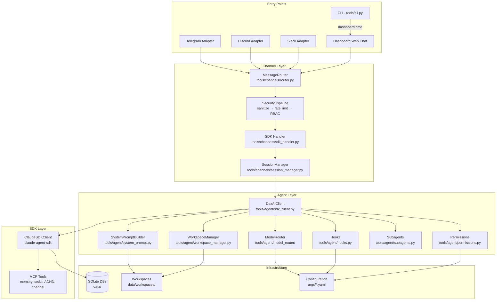
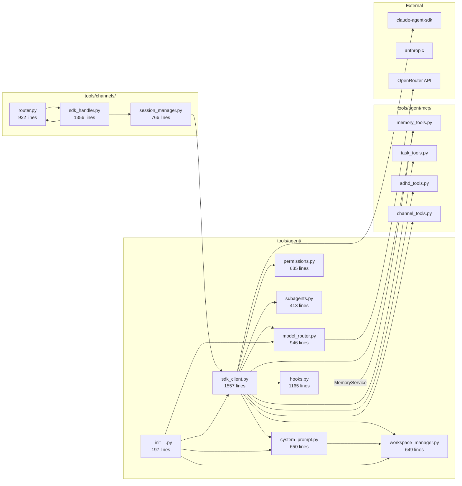
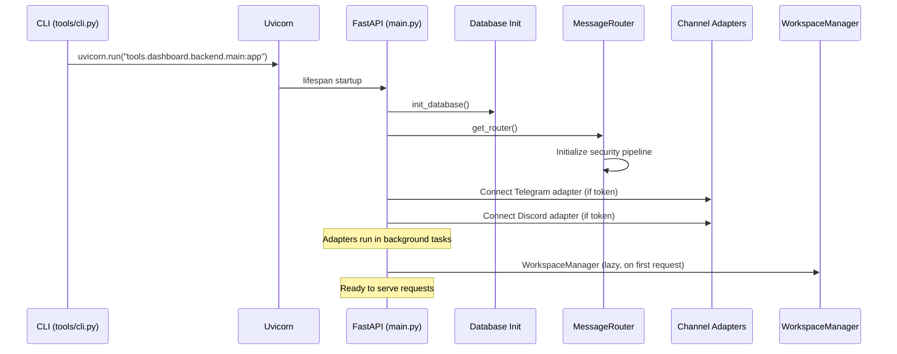
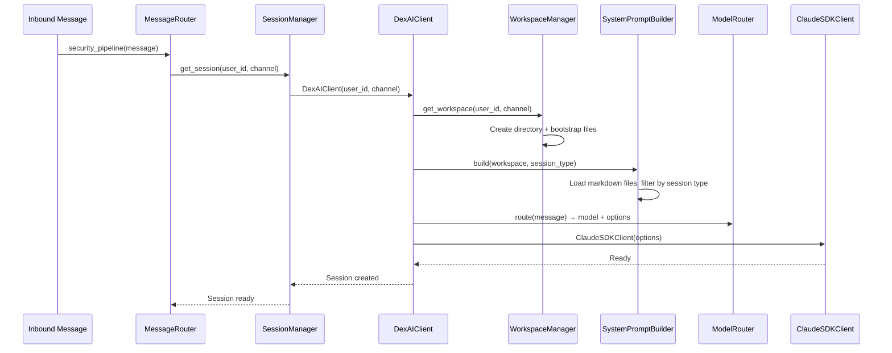

# Core Architecture & SDK Integration Review

**Agent:** Agent 1 — Core Architecture & SDK Integration Reviewer
**Date:** 2026-02-11
**Scope:** DexAI GOTCHA Framework, Claude Agent SDK integration, module dependencies, configuration management, deployment architecture

---

## 1. Research Baseline Summary

### Claude Agent SDK Best Practices
The Claude Agent SDK (`claude-agent-sdk`) provides first-party primitives for building agentic systems:
- **Hooks** for production control: `PreToolUse`, `PostToolUse`, `Stop`, `PreCompact`, `UserPromptSubmit` — each hook can block, modify, or observe tool executions
- **Multi-agent orchestration** via `agents` parameter on `ClaudeAgentOptions` — subagents share the parent's tool set but receive separate system prompts
- **Context isolation** — each `ClaudeSDKClient` manages its own conversation state; session resumption via `resume` parameter preserves context across connections
- **Observability** — hooks provide natural instrumentation points; `HookResult` can carry metadata
- **Secure deployment** — SDK includes a sandboxed `Bash` tool; `permissions` callback gates tool access at runtime
- **MCP tools** — external tool servers registered via `mcp_servers` parameter, extending the agent's capabilities without modifying the SDK

### Letta/MemGPT
- **Stateful agents** with self-editing memory: agents can modify their own system prompt and core memory blocks at runtime
- **Model-agnostic** state persistence — memory stored in a database, not in LLM context
- **Agent lifecycle management** — create, pause, resume, delete agents as first-class entities
- **Key insight for DexAI:** Letta's "inner thoughts" pattern (agent reasons about what to remember) is more sophisticated than DexAI's hook-based memory. DexAI's approach of saving context at `Stop` and `PreCompact` hooks is simpler but less granular.

### Agent Zero
- **Prompt-driven behavior** — minimal hard-coded tools; most behavior defined in system prompts
- **Agent communication hierarchy** — parent/child agents communicate via message passing
- **Key insight for DexAI:** Agent Zero's extreme flexibility through prompts mirrors DexAI's `SystemPromptBuilder` approach, but DexAI adds structured layers (workspace files, session-type filtering) that provide more guardrails.

### OpenClaw
- **Gateway-centric design** — all requests flow through a single gateway that handles auth, routing, rate limiting
- **Lane Queue system** — serial execution per user prevents concurrent mutation conflicts
- **Allowlist security** — explicit tool whitelisting rather than blocklist patterns
- **JSONL transcripts** — full audit trail of all agent interactions
- **Key insight for DexAI:** OpenClaw's allowlist approach is the inverse of DexAI's blocklist (bash security regex patterns). An allowlist is generally more secure — DexAI's `create_bash_security_hook()` could miss novel attack patterns.

---

## 2. Architecture Overview



**Data Flow (message lifecycle):**
1. Channel adapter receives message → converts to `UnifiedMessage`
2. `MessageRouter.security_pipeline()` runs: sanitize → user resolution → pairing check → setup gate → rate limit → permission check
3. `sdk_handler()` or `sdk_handler_with_streaming()` dispatched based on channel capabilities
4. `SessionManager.get_session()` returns existing or creates new `Session` (wrapping `DexAIClient`)
5. `DexAIClient._init_client()` assembles `ClaudeAgentOptions`: model (via router), hooks, permissions, MCP tools, system prompt (via builder), subagents, sandbox config
6. `ClaudeSDKClient` executes the query, hooks fire at each tool use
7. Response flows back through channel-specific formatting (message limits, code block handling)

---

## 3. Module Dependency Graph



**Key Observations:**
- `sdk_client.py` is the **central hub** — it imports from 6 sibling modules plus the SDK. At 1557 lines, it's the largest and most complex module.
- `sdk_handler.py` (1356 lines) is the second-largest module, handling all channel-specific streaming logic.
- There is a **circular awareness** between `router.py` and `sdk_handler.py` — the handler sends responses through the router's adapters. This isn't a Python import cycle (handler imports router at function level), but it's a design coupling.
- `__init__.py` uses lazy loading via `__getattr__` to avoid import-time side effects — this is a good pattern.

---

## 4. SDK Integration Assessment

**Score: 7/10**

### What's Done Well

| Aspect | Assessment | Evidence |
|--------|-----------|----------|
| **Hook utilization** | Excellent | All 5 hook types used: PreToolUse (security+audit), PostToolUse (dashboard), Stop (context save), PreCompact (memory checkpoint), UserPromptSubmit (L1 re-injection). `hooks.py:40-80` `HookMetrics` singleton with timing/percentile tracking. |
| **Permission callback** | Good | `permissions.py:85-160` maps SDK tools to RBAC permissions. Read-only tools auto-approved for lower friction. Graceful fallback to allow on import errors. |
| **Session resumption** | Good | `sdk_client.py:280-310` captures `session_id` from SDK response; `session_manager.py:180-220` persists sessions to JSON and resumes via SDK's `resume` parameter. |
| **Subagent registration** | Good | `subagents.py:30-180` defines 4 ADHD-specific agents as `AgentDefinition` dataclasses, converted to SDK types via `get_agents_for_sdk()`. |
| **MCP tool integration** | Good | `sdk_client.py:180-220` registers `dexai_server` MCP providing memory, task, ADHD, and channel tools. |
| **Sandbox configuration** | Good | `sdk_client.py:150-170` configures SDK sandbox from `args/agent.yaml` settings. |

### Areas for Improvement

| Issue | Severity | Details |
|-------|----------|---------|
| **Code duplication in `query_structured()`** | Medium | `sdk_client.py` — `query_structured()` duplicates significant portions of `_init_client()` to create temporary clients with `output_format`. This is ~100 lines of near-identical setup logic. Should extract shared client-building logic. |
| **Session ID extraction fragility** | Medium | `sdk_client.py` `_extract_session_id()` checks 4 different locations (direct attribute, data dict, data object, client) — this suggests the SDK's session ID location has changed across versions or is inconsistently exposed. Should pin to documented API. |
| **Hook error swallowing** | Low | `hooks.py` — several hooks catch broad `Exception` and log warnings but continue. While this prevents hook failures from crashing the agent, it could mask real issues silently. |
| **No hook ordering guarantees** | Low | Multiple PreToolUse hooks (bash security, file path security, audit) are registered in a list. The SDK processes them in order, but there's no explicit ordering mechanism if hooks need to run in a specific sequence. |

### SDK Feature Utilization

| SDK Feature | Used? | Notes |
|-------------|-------|-------|
| `ClaudeSDKClient` | Yes | Core wrapper in `DexAIClient` |
| `ClaudeAgentOptions` | Yes | Full configuration in `_init_client()` |
| `PreToolUse` hook | Yes | Security + audit |
| `PostToolUse` hook | Yes | Dashboard analytics |
| `Stop` hook | Yes | Context saving |
| `PreCompact` hook | Yes | Memory checkpoint |
| `UserPromptSubmit` hook | Yes | Post-compaction re-injection |
| `agents` (subagents) | Yes | 4 ADHD subagents |
| `mcp_servers` | Yes | DexAI MCP tools |
| `permissions` callback | Yes | RBAC integration |
| `resume` parameter | Yes | Session continuity |
| `output_format` (structured) | Yes | JSON schema responses |
| `sandbox` configuration | Yes | From agent.yaml |
| Streaming | Yes | `query_stream()` with AsyncGenerator |

---

## 5. Separation of Concerns

### GOTCHA Framework Adherence

The GOTCHA framework (Goals, Orchestration, Tools, Context, Hard prompts, Args) is the declared architecture. Here's how well the implementation follows it:

| Layer | Declared Purpose | Actual Implementation | Adherence |
|-------|-----------------|----------------------|-----------|
| **Goals** (`goals/`) | Process definitions | Markdown files defining workflows and phases | Strong — goals are pure documentation, not executable |
| **Orchestration** | AI manager coordinating execution | `DexAIClient` + `SessionManager` + `MessageRouter` | Strong — orchestration is cleanly in the agent/channel layers |
| **Tools** (`tools/`) | Deterministic scripts | Mix of deterministic tools AND orchestration logic | **Mixed** — `tools/agent/` and `tools/channels/` contain orchestration, not just deterministic execution |
| **Context** (`context/`) | Reference material | Static markdown files | Strong — pure reference |
| **Hard prompts** (`hardprompts/`) | Reusable LLM templates | Template files for sub-tasks | Strong — focused templates |
| **Args** (`args/`) | Behavior settings | YAML configs driving runtime behavior | Strong — clean separation |

### Key Concern: `tools/` Conflation

The `tools/` directory mixes two fundamentally different things:
1. **Deterministic tools** (what GOTCHA intends): `tools/memory/`, `tools/security/`, `tools/office/` — these do one job reliably
2. **Orchestration infrastructure** (should arguably be separate): `tools/agent/`, `tools/channels/`, `tools/dashboard/` — these are the system's nervous system, not individual tools

This isn't necessarily wrong for a solo-developer project (fewer directories = less navigation overhead), but it does blur the GOTCHA layer boundaries. If the project grows, extracting `tools/agent/` and `tools/channels/` into a top-level `core/` or `engine/` directory would improve clarity.

### Module Responsibility Analysis

| Module | Single Responsibility? | Notes |
|--------|----------------------|-------|
| `sdk_client.py` | **No** — does too much | Client initialization, query execution, response formatting, ADHD post-processing, structured queries, streaming, session ID extraction. Consider splitting: `client_factory.py` (init), `query_engine.py` (execution), `response_formatter.py` (ADHD post-processing). |
| `hooks.py` | **Yes** (collection pattern) | Multiple hooks is fine — they're all hook factories. The `HookMetrics` singleton is a cross-cutting concern that fits here. |
| `permissions.py` | **Yes** | Clean single purpose: map SDK tools to RBAC. |
| `subagents.py` | **Yes** | Defines agent configurations. Clean and focused. |
| `system_prompt.py` | **Yes** | Composes prompts from workspace files. Well-bounded. |
| `workspace_manager.py` | **Yes** | Manages per-user workspace directories. |
| `model_router.py` | **Yes** | Complexity classification + model selection. |
| `router.py` | **Mostly** | Central hub doing routing + security pipeline. The security pipeline could be extracted but isn't large enough to warrant it. |
| `session_manager.py` | **Yes** | Session lifecycle management. |
| `sdk_handler.py` | **No** — too many concerns | Channel-specific streaming (Slack, Discord, Telegram each have custom logic), attachment processing, image generation dispatch, ask-user handling. This is the second candidate for splitting. |

---

## 6. Configuration Management

### Configuration Sources

| Source | Location | Format | Hot-reload? | Purpose |
|--------|----------|--------|-------------|---------|
| `args/agent.yaml` | Static file | YAML | No (read at client init) | Agent behavior: model, tools, ADHD settings, sandbox, subagents |
| `args/routing.yaml` | Static file | YAML | No | Routing profiles, budget, complexity thresholds, Exacto |
| `args/workspace.yaml` | Static file | YAML | No | Workspace isolation, scope, templates, restrictions |
| `args/user.yaml` | Dynamic file | YAML | Per-session | User onboarding data (name, timezone, preferences) |
| `args/dashboard.yaml` | Static file | YAML | No | CORS, auth, dashboard settings |
| `args/multimodal.yaml` | Static file | YAML | No | Attachment limits, processing costs |
| `.env` | Environment | Key=Value | No | API keys, secrets, deployment flags |
| `data/sessions.json` | Runtime state | JSON | N/A | Active session persistence |
| Workspace markdown files | Per-user | Markdown | Per-session | PERSONA.md, IDENTITY.md, etc. |

### Configuration Loading Pattern

Configuration is loaded at multiple levels with no unified loader:

```python
# Pattern 1: Direct YAML loading (most common)
# tools/agent/sdk_client.py, tools/agent/model_router/model_router.py, etc.
config_path = PROJECT_ROOT / "args" / "agent.yaml"
with open(config_path) as f:
    config = yaml.safe_load(f)

# Pattern 2: Module-level constants
# tools/agent/__init__.py
CONFIG_PATH = PROJECT_ROOT / "args" / "agent.yaml"

# Pattern 3: Inline defaults
# tools/agent/sdk_client.py — falls back to hardcoded defaults if config missing
model = agent_config.get("model", "sonnet")
```

### Assessment

**What works:** The YAML-based configuration is readable, well-documented with comments, and follows a consistent structure. The `args/` directory is clean.

**What could improve:**
1. **No config validation** — YAML files are loaded with `yaml.safe_load()` and accessed via `.get()` with defaults scattered across the codebase. A schema validation layer (even basic `dataclass` mapping) would catch typos and missing fields early.
2. **No centralized config loader** — Each module independently loads and parses YAML. A single `ConfigManager` would reduce duplication and enable hot-reloading.
3. **Secrets in `.env` vs config in `args/`** — This split is correct but the boundary is implicit. `args/routing.yaml` references `OPENROUTER_API_KEY` which must be in `.env` — the connection between config files and required env vars isn't documented per-file.

---

## 7. Dependency Tree Analysis

### Core Dependencies (from `pyproject.toml`)

```
dexai
├── anthropic >= 0.40.0          # Claude API client
├── claude-agent-sdk >= 0.1.30   # Agent SDK (THE critical dependency)
├── fastapi                       # Dashboard backend
├── uvicorn                       # ASGI server
├── httpx                         # HTTP client
├── pyyaml                        # Config loading
├── textual + rich                # TUI (setup wizard - legacy?)
├── python-dateutil               # Date parsing
├── pydantic                      # Data validation (via FastAPI)
└── Optional extras:
    ├── [channels] → python-telegram-bot, discord.py, slack-sdk
    ├── [multimodal] → pillow, pypdf2, python-docx, openai
    ├── [office] → google-auth, google-api-python-client, msal
    ├── [memory-providers] → mem0ai, zep-cloud
    └── [dev] → pytest, ruff, mypy, coverage

Key transitive dependencies:
├── anthropic → httpx, pydantic, tokenizers
├── claude-agent-sdk → anthropic (implied)
├── fastapi → starlette, pydantic, anyio
└── python-telegram-bot → httpx (shared with anthropic)
```

### Dependency Risk Assessment

| Dependency | Risk | Rationale |
|------------|------|-----------|
| `claude-agent-sdk >= 0.1.30` | **High** | Pre-1.0 SDK. The `_extract_session_id()` checking 4 locations suggests API instability. Breaking changes likely. Pin more tightly (e.g., `>=0.1.30,<0.2.0`). |
| `anthropic >= 0.40.0` | **Medium** | Mature client but `>=` constraint allows major bumps. Consider upper bound. |
| `textual + rich` | **Low-Medium** | Only used for TUI setup wizard. Since setup moved to dashboard chat (PR #85), these may be dead dependencies. Removing them would reduce install footprint. |
| `openai` (in multimodal extra) | **Low** | Only used for DALL-E image generation. Well-isolated in `image_generator.py`. |
| `httpx` | **Low** | Shared by `anthropic` and `python-telegram-bot`. No version conflict risk. |

### Potential Dead Dependencies
- `textual` and `rich` — The CLI `cmd_setup()` just prints a message directing to the dashboard. The TUI wizard may be unused. Verify before removing.

---

## 8. Startup & Initialization

### Application Startup Sequence



### Per-Request Initialization (First Message)



### Initialization Concerns

1. **Cold start cost:** First message for a new user triggers: workspace creation (file I/O), markdown file loading, model routing classification, SDK client instantiation. This is sequential and could be slow.
2. **No connection pooling:** Each `DexAIClient` creates a fresh `ClaudeSDKClient`. The SDK may handle HTTP pooling internally, but this isn't verified.
3. **Session persistence is JSON file-based** (`data/sessions.json`). Fine for single-instance deployment but would break with multiple backend instances. The Docker Compose setup runs a single backend, so this is acceptable for now.
4. **Workspace bootstrap is synchronous** in `WorkspaceManager.get_workspace()`. For concurrent users, this could be a bottleneck if many new users arrive simultaneously (file I/O contention).

---

## 9. Comparison Matrix

| Capability | DexAI | Claude SDK (vanilla) | Letta/MemGPT | Agent Zero | OpenClaw |
|-----------|-------|---------------------|-------------|------------|---------|
| **Agent Framework** | GOTCHA (6-layer) | Minimal (hooks + tools) | Stateful agent lifecycle | Prompt-driven hierarchy | Gateway + Lane Queue |
| **Memory** | Hook-based save/restore + hybrid search (BM25+embeddings) | None (context window only) | Self-editing memory blocks | Conversation persistence | JSONL transcripts |
| **Multi-model Routing** | OpenRouter with complexity classification (5 tiers, 6 profiles) | Single model | Model-agnostic swapping | Single model per agent | Model per endpoint |
| **Security Model** | Blocklist (regex) + RBAC + workspace isolation | Sandbox + permissions callback | API key auth | Sandboxed Docker | Allowlist + API keys |
| **Session Management** | JSON file persistence + SDK resume | SDK built-in resume | Database-backed state | File-based context | Server-side sessions |
| **Multi-channel** | Telegram, Discord, Slack, Web | N/A (SDK is headless) | REST API only | Terminal + HTTP | HTTP only |
| **Subagents** | 4 ADHD-specific (haiku/sonnet) | SDK `agents` parameter | Agent-to-agent calls | Parent/child hierarchy | N/A |
| **Observability** | Hook metrics + audit logs + dashboard analytics | Basic hook callbacks | Built-in telemetry | Logging | JSONL audit |
| **Deployment** | Docker Compose + Caddy + Tailscale | N/A | Docker or pip | Docker | Docker + K8s |
| **Unique Value** | ADHD-aware UX (RSD-safe language, energy matching, task decomposition, one-thing mode) | Raw SDK power | Self-modifying memory | Maximum flexibility | Production queue system |

### Where DexAI Excels vs. Reference Implementations
1. **Multi-channel support** — Most frameworks are single-channel. DexAI's adapter pattern with unified message format is well-designed.
2. **ADHD-specific tooling** — No other framework has energy matching, RSD-safe communication, or friction solving. This is genuine differentiation.
3. **Model routing sophistication** — The 5-tier complexity classification with 6 routing profiles and Exacto support is more sophisticated than any reference implementation.
4. **Workspace isolation** — Per-user workspace directories with bootstrap files provide clean multi-tenancy that most frameworks lack.

### Where DexAI Falls Behind
1. **Memory sophistication** — Letta's self-editing memory is more powerful than DexAI's hook-based approach. DexAI saves at boundaries (stop, compact); Letta reasons about memory continuously.
2. **Security model** — OpenClaw's allowlist is fundamentally more secure than DexAI's blocklist approach. New attack vectors require updating regex patterns.
3. **Queue/concurrency** — OpenClaw's Lane Queue ensures serial execution per user, preventing race conditions. DexAI has no equivalent; concurrent messages from the same user could theoretically cause issues.
4. **State persistence** — JSON file for sessions is fragile. Letta and OpenClaw both use proper databases for agent state.

---

## 10. Architectural Debt Inventory

### High Priority

| # | Debt Item | Location | Impact | Effort |
|---|-----------|----------|--------|--------|
| 1 | **`sdk_client.py` is too large (1557 lines)** | `tools/agent/sdk_client.py` | Hard to maintain, test, and reason about. Contains client init, query execution, response formatting, ADHD post-processing, structured queries, streaming, and session ID extraction. | Medium — Extract `ClientFactory`, `QueryEngine`, `ResponseFormatter` |
| 2 | **`sdk_handler.py` channel-specific sprawl (1356 lines)** | `tools/channels/sdk_handler.py` | Each channel (Slack, Discord, Telegram) has custom streaming logic mixed into one file. Adding a new channel means modifying this monolith. | Medium — Extract per-channel handler classes |
| 3 | **`query_structured()` duplicates `_init_client()`** | `tools/agent/sdk_client.py` | ~100 lines of near-identical client setup. Changes to init logic must be mirrored in two places. | Low — Extract shared builder method |
| 4 | **No config validation** | All `args/*.yaml` consumers | Typos in YAML go undetected until runtime. Missing keys produce silent `.get()` defaults that may not match intent. | Low — Add Pydantic models or dataclass validation |
| 5 | **Session persistence via JSON file** | `tools/channels/session_manager.py` | Single point of failure; no locking; can't scale to multiple backend instances; corrupt file = all sessions lost. | Medium — Migrate to SQLite (already used for other data) |

### Medium Priority

| # | Debt Item | Location | Impact | Effort |
|---|-----------|----------|--------|--------|
| 6 | **Blocklist security model** | `tools/agent/hooks.py` `create_bash_security_hook()` | Regex-based blocking is inherently incomplete — novel command patterns bypass it. An allowlist of permitted commands would be safer. | Medium — Requires careful analysis of needed commands |
| 7 | **No per-user message queue** | `tools/channels/router.py` | Concurrent messages from the same user hit the same session simultaneously. No serial execution guarantee. Could cause state corruption in workspace files or session data. | Medium — Add per-user asyncio.Lock or queue |
| 8 | **`_extract_session_id()` fragility** | `tools/agent/sdk_client.py` | Checking 4 locations for session ID suggests SDK version instability. A single SDK update could break session resumption silently. | Low — Pin SDK version tighter, add integration test |
| 9 | **Dead TUI dependencies** | `pyproject.toml` — `textual`, `rich` | Setup wizard moved to dashboard chat. These add install weight (~30MB with deps) for potentially unused functionality. | Low — Verify and remove if unused |
| 10 | **No graceful degradation for OpenRouter** | `tools/agent/model_router/model_router.py` | If OpenRouter is down, the router has no fallback to direct Anthropic API. System becomes unavailable even though Anthropic API may be fine. | Low-Medium — Add direct Anthropic fallback |

### Low Priority

| # | Debt Item | Location | Impact | Effort |
|---|-----------|----------|--------|--------|
| 11 | **Hook error swallowing** | `tools/agent/hooks.py` | Broad `except Exception` in hooks prevents crashes but silently drops errors. Could mask memory save failures, audit gaps, etc. | Low — Add structured error reporting to HookMetrics |
| 12 | **Workspace bootstrap race condition** | `tools/agent/workspace_manager.py` | If two requests for the same new user arrive simultaneously, both may try to create/bootstrap the workspace. | Low — Add file-level locking or atomic creation |
| 13 | **Hardcoded message limits** | `tools/channels/sdk_handler.py` | Telegram 4096, Discord 2000, Slack 40000 are hardcoded. Should be in channel adapter config. | Low — Move to args or adapter metadata |

---

## 11. What Works Well

### 1. GOTCHA Framework Clarity
The 6-layer framework provides an excellent mental model for organizing a complex agentic system. Even where implementation blurs boundaries (see Section 5), the framework makes it easy to reason about where new code belongs. For a solo developer, this architectural clarity is invaluable — it prevents the "where does this go?" problem that kills solo projects.

### 2. Hook System Design (`tools/agent/hooks.py`)
The hook architecture is the strongest part of the codebase:
- **`HookMetrics` singleton** with timing, percentile calculation, and slow hook detection provides production-grade observability from day one
- **`@timed_hook` / `@async_timed_hook` decorators** are clean and reusable
- **Defense-in-depth layering**: SDK sandbox → PreToolUse bash security → PreToolUse file path security → RBAC permissions → workspace isolation. Five security layers.
- **`create_hooks()` builder pattern** assembles all hooks into SDK-compatible format — easy to add/remove hooks

### 3. SystemPromptBuilder Session Filtering (`tools/agent/system_prompt.py`)
The `SessionType` enum with per-type file allowlists is elegant:
- `main` sessions get all workspace files (PERSONA, IDENTITY, USER, AGENTS, ENV, HEARTBEAT)
- `subagent` sessions get only PERSONA + AGENTS (minimal context, faster, cheaper)
- `heartbeat`/`cron` sessions get tailored subsets

This prevents context pollution and reduces token costs for subagent calls. It's a pattern worth highlighting.

### 4. Model Router Sophistication (`tools/agent/model_router/model_router.py`)
The complexity classifier with 5 tiers and 6 routing profiles is well-engineered:
- **Zero-latency local classification** — no API call needed to route
- **Heuristic scoring** considers word count, tool keywords, reasoning keywords, code context, multi-step indicators
- **SubagentStrategy** prevents expensive models for trivial subagent calls
- **Budget controls** at per-session, per-day, and per-user levels
- **Exacto support** for improved tool-calling accuracy on complex tasks

### 5. Channel Adapter Pattern (`tools/channels/router.py`)
The `ChannelAdapter` ABC with `to_unified()` / `from_unified()` converters is a clean abstraction. Adding a new channel requires implementing one class, not modifying core logic. The `UnifiedMessage` format standardizes the internal representation.

### 6. Workspace Isolation (`tools/agent/workspace_manager.py`)
Per-user workspace directories with bootstrap files from templates provide:
- Clean multi-tenancy without database-level isolation
- Easy customization (just edit markdown files)
- Security boundaries (workspace restriction enforcement)
- Onboarding flow integration (`_populate_from_user_yaml()`)

### 7. Lazy Loading in `__init__.py`
The `__getattr__` pattern in `tools/agent/__init__.py` avoids import-time side effects and circular imports. Modules are only loaded when first accessed.

---

## 12. Recommendations

### Priority 1: Split `sdk_client.py` (Effort: Medium, Impact: High)

The 1557-line monolith should become:
- **`client_factory.py`** — `_init_client()` logic, `ClaudeAgentOptions` assembly
- **`query_engine.py`** — `query()`, `query_structured()`, `query_stream()` with shared client-building
- **`response_formatter.py`** — ADHD post-processing, preamble stripping, length limits
- **`sdk_client.py`** — Thin facade that composes the above

This immediately fixes debt items #1 and #3 (code duplication in `query_structured()`).

### Priority 2: Add Per-User Message Queue (Effort: Medium, Impact: High)

Without serial execution guarantees per user, concurrent messages can corrupt state. Add:
```python
# In SessionManager or MessageRouter
user_locks: dict[str, asyncio.Lock] = {}

async def process_with_lock(user_id: str, message):
    lock = user_locks.setdefault(user_id, asyncio.Lock())
    async with lock:
        return await process_message(message)
```

This mirrors OpenClaw's Lane Queue pattern and prevents race conditions.

### Priority 3: Migrate Session Storage to SQLite (Effort: Low-Medium, Impact: Medium)

Replace `data/sessions.json` with a SQLite table:
- Atomic writes (no corrupt JSON)
- Built-in locking
- Already have SQLite infrastructure for memory and activity databases
- Enables future multi-instance deployment

### Priority 4: Add Config Validation (Effort: Low, Impact: Medium)

Create Pydantic models for each `args/*.yaml` file:
```python
class AgentConfig(BaseModel):
    model: str = "sonnet"
    max_turns: int = 50
    sandbox: bool = True
    # ... validated at load time
```

Load once at startup, pass the validated config object rather than raw dicts. Catches typos immediately.

### Priority 5: Consider Allowlist for Bash Security (Effort: Medium, Impact: Medium)

The current blocklist approach (`hooks.py` `create_bash_security_hook()`) uses regex to catch dangerous patterns. Consider supplementing with an allowlist of known-safe command prefixes:
```python
ALLOWED_PREFIXES = ["python", "cat", "ls", "git", "npm", "node", ...]
```

Run the allowlist check first (fast path), fall through to blocklist for commands not in the allowlist. This provides defense-in-depth without breaking existing functionality.

### Priority 6: Extract Channel-Specific Handlers (Effort: Medium, Impact: Low-Medium)

Split `sdk_handler.py` into:
- `sdk_handler.py` — Core handler logic, dispatcher
- `handlers/telegram.py` — Telegram-specific streaming
- `handlers/discord.py` — Discord-specific streaming (2000 char chunking)
- `handlers/slack.py` — Slack-specific streaming (message editing)

Each new channel becomes a new file, not a new branch in a 1356-line conditional.

### Not Recommended (Over-Engineering for Solo Dev)

- **Microservices split** — The monolith works fine for the current scale. Don't split until you have scaling problems.
- **Event sourcing for sessions** — SQLite is sufficient. Event sourcing adds complexity without clear benefit.
- **Kubernetes deployment** — Docker Compose handles the deployment needs. K8s adds operational burden.
- **Full schema migration system** — Simple `CREATE TABLE IF NOT EXISTS` is fine for now. Add Alembic when schemas stabilize.

---

## Summary

DexAI is a well-architected agentic system that makes strong use of the Claude Agent SDK. The GOTCHA framework provides clear organizational principles, and the implementation demonstrates sophisticated patterns (hook metrics, session-type prompt filtering, complexity-based model routing, workspace isolation).

The primary technical risks are:
1. **Module size** — `sdk_client.py` and `sdk_handler.py` are approaching maintenance pain thresholds
2. **Concurrency safety** — No per-user message serialization
3. **Session persistence fragility** — JSON file instead of database
4. **Security model completeness** — Blocklist approach has inherent gaps

The ADHD-specific features (subagents, RSD-safe communication, energy matching, friction solving) represent genuine product differentiation that no competing framework offers. The model routing sophistication is also ahead of reference implementations.

For a solo-developer project, this is impressive engineering. The recommendations above are ordered by impact-to-effort ratio — start with the splits and the per-user lock, which provide the most safety and maintainability improvement for moderate effort.
