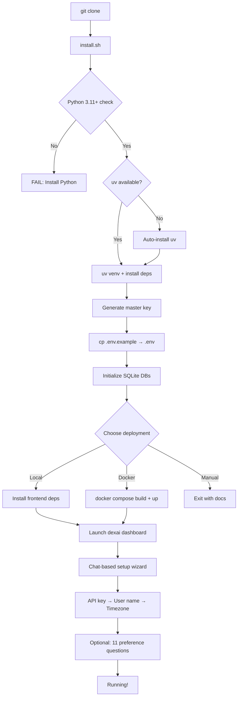
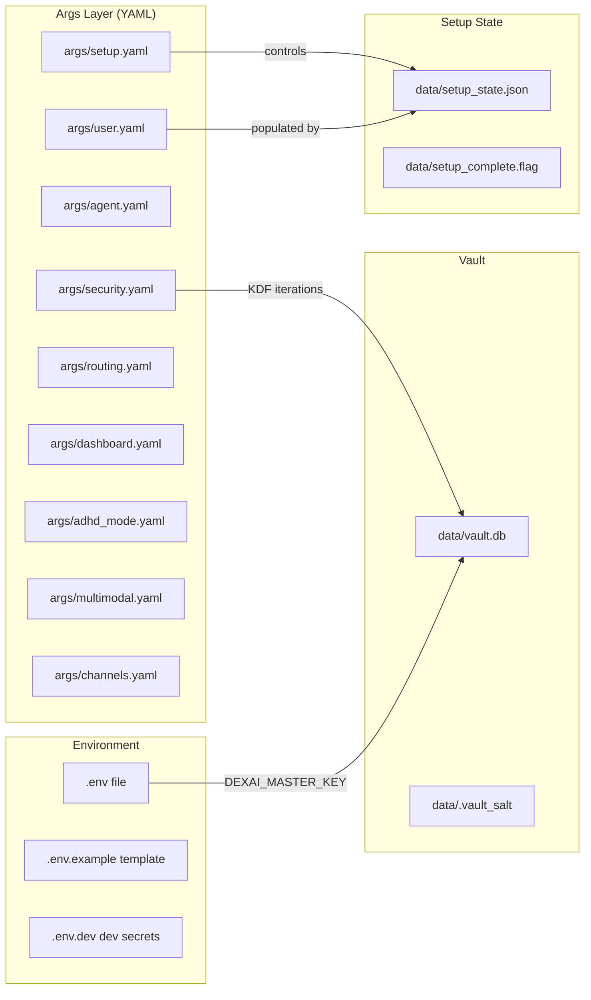
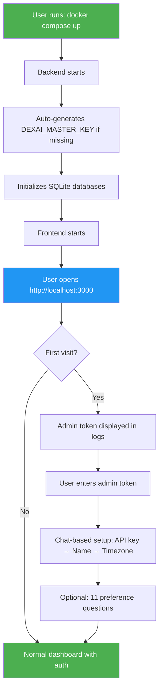

# DexAI Installation, Configuration & Deployment Security Review

**Date:** 2026-02-11
**Reviewer:** Agent 2 — Deployment Specialist

---

## Research Baseline

### Reference Implementations Studied

| Project | Installation Model | Time to Running | Key Lesson |
|---------|-------------------|-----------------|------------|
| **Agent Zero** | Docker pull → `localhost:50001` | ~2 minutes | Two-tier image strategy (base + app), web-first config, zero env vars needed to start |
| **Letta** | `pip install letta` or Docker | ~3 minutes | Desktop app for zero-config, SQLite auto-creates, password protection opt-in |
| **n8n AI Starter Kit** | `docker compose up` | ~5 minutes | Single compose file, all dependencies bundled, `.env.example` with clear required/optional |
| **OpenClaw/Superagent** | Docker + API gateway | ~10 minutes | Guardrail framework, sandbox execution, Kubernetes-native isolation |

### Industry Patterns (2025–2026)

1. **One-command-to-running** is table stakes: `docker compose up` or `pip install X && X serve`
2. **Secure-by-default** means no exposed ports, no plaintext secrets, non-root containers
3. **Progressive disclosure** for configuration — ask only what's needed, reveal complexity later
4. **Embedded defaults** — SQLite for single-tenant, auto-generated secrets, auto-TLS via Caddy/Tailscale
5. **Defense-in-depth** for AI agents: sandboxed execution, tool-use validation, cost guardrails

---

## Installation Flow Analysis

### Current Steps: Clone to Running



### Step Count & Friction Points

| Step | Command / Action | Friction Level | Notes |
|------|-----------------|---------------|-------|
| 1 | `git clone` | Low | Standard |
| 2 | `bash install.sh` | **Medium** | 1078-line script, OS detection, auto-installs uv/bun/Docker |
| 3 | Deployment choice menu | Low | Interactive menu (1=Local, 2=Docker, 3=Manual) |
| 4 | Frontend npm install | **Medium** | Requires Node.js 20+, separate npm install step |
| 5 | Configure `.env` | **High** | Must manually add ANTHROPIC_API_KEY — no prompt in non-interactive |
| 6 | `dexai dashboard` or `docker compose up` | Low | Single command |
| 7 | Chat-based onboarding | Low | Well-designed progressive flow |

**Total time estimate:** 5–15 minutes (depending on Docker availability and API keys at hand)

### Comparison: DexAI vs Competitors

| Metric | DexAI | Agent Zero | Letta | n8n Starter |
|--------|-------|-----------|-------|-------------|
| Commands to running | 3–5 | 1 (`docker run`) | 1 (`pip install`) | 1 (`docker compose up`) |
| Requires API key upfront | Yes (at setup) | Yes (settings UI) | No (can use local models) | Optional |
| Auto-generates secrets | Yes (master key) | N/A | N/A | N/A |
| Non-root container | Yes | Partial | Yes | Yes |
| Config validation | Partial | Settings UI | Full | Full |
| Browser opens automatically | Yes (install.sh) | Yes | Yes (Desktop) | No |
| Resumable setup | Yes | Yes | Yes | N/A |

---

## Dependency Management

### Package Manager: uv

- **Lockfile**: `uv.lock` exists and is tracked in git — **good for reproducibility**
- **pyproject.toml**: Well-structured with 9 optional dependency groups (`dev`, `channels`, `office`, `multimodal`, `memory-providers`, etc.)
- **install.sh** (`install.sh:226-270`): Falls back gracefully from `uv` → `pip3` → `pip` → `python3 -m pip`
- **Dockerfile** (`Dockerfile:12`): Copies `uv` binary from official image — deterministic, no curl-piping

### Assessment

| Aspect | Status | Notes |
|--------|--------|-------|
| Lockfile committed | ✅ Good | `uv.lock` tracked in git |
| Deterministic builds | ✅ Good | Docker uses `uv pip install` with cache mount |
| Version pinning | ⚠️ Partial | Uses `>=` minimum versions, not exact pins in pyproject.toml (lockfile compensates) |
| Multi-stage build | ✅ Good | Builder → Runtime separation in `Dockerfile` |
| Dependency groups | ✅ Good | Clean separation of optional extras |
| `python-telegram-bot` duplication | ⚠️ Minor | Listed both in `dependencies` (line 42) AND `[project.optional-dependencies].telegram` (line 57) |

### Concern: `claude-agent-sdk>=0.1.30` in core dependencies

The `claude-agent-sdk` is listed as a core dependency (`pyproject.toml:42`), not optional. This means every installation pulls in the Claude Agent SDK even if the user only wants the dashboard. Consider making it optional for lighter installs.

---

## Configuration Architecture

### Configuration Files Map



### Configuration Validation

| Config File | Schema Validation | Hot-Reload | Default Generation |
|-------------|------------------|------------|-------------------|
| `args/security.yaml` | ❌ None | ❌ No | ✅ Ships with defaults |
| `args/setup.yaml` | ❌ None | ❌ No | ✅ Ships with defaults |
| `args/user.yaml` | ❌ None | ❌ No | ✅ Generated by setup wizard |
| `.env` | ❌ None | ❌ No | ✅ Copied from `.env.example` |
| `args/agent.yaml` | ❌ None | Partial (routing reads at request time) | ✅ Ships with defaults |

**Key finding:** No YAML files have schema validation. A typo in `args/security.yaml` (e.g., `kdf_iteations: 100000`) would silently use defaults or crash at runtime. There are no JSON Schema files, no Pydantic models for config loading, and no startup validation.

### Configuration Dependency Chain

The startup flow has implicit dependencies:

1. `.env` must have `DEXAI_MASTER_KEY` → vault operations work
2. `.env` must have `ANTHROPIC_API_KEY` → OR vault must have it → OR setup wizard collects it
3. `args/user.yaml` must have name + timezone → setup wizard considered complete
4. `args/security.yaml` settings are advisory — code has hardcoded fallback defaults

---

## Secret & Credential Management

### Secret Inventory

| Secret | Where Stored | Access Pattern | Rotation Support |
|--------|-------------|---------------|-----------------|
| `DEXAI_MASTER_KEY` | `.env` file (plaintext) | Read at startup, used for vault KDF | Manual (`make rotate-master-key` — **destructive**, invalidates all vault data) |
| `ANTHROPIC_API_KEY` | `.env` AND vault | `.env` as fallback, vault preferred | Manual |
| `OPENAI_API_KEY` | `.env` | Direct env var read | Manual |
| `TELEGRAM_BOT_TOKEN` | `.env` OR vault | Vault preferred, env fallback | Manual |
| `DISCORD_BOT_TOKEN` | `.env` OR vault | Same | Manual |
| `SLACK_BOT_TOKEN` | `.env` OR vault | Same | Manual |
| `SLACK_APP_TOKEN` | `.env` OR vault | Same | Manual |
| `TAILSCALE_AUTHKEY` | `.env` | Direct env var | Manual |
| `HELICONE_API_KEY` | `.env` | Direct env var | Manual |
| OAuth tokens (Google/MS) | Vault (`data/vault.db`) | `tools/office/oauth_manager.py` | Automatic refresh |
| Vault salt | `data/.vault_salt` (raw bytes) | Read by `vault.py` | Never rotated |
| Session tokens | `data/sessions.db` (SHA-256 hash) | `tools/security/session.py` | Auto-expire (24h default) |

### Vault Architecture Assessment

**Strengths:**
- AES-256-GCM encryption at rest (`vault.py:91-99`)
- PBKDF2 key derivation with 100k iterations (`vault.py:76-88`)
- Unique 32-byte salt per installation (`vault.py:63-73`)
- Namespace isolation for multi-tenant scenarios
- Audit logging on all access (`vault.py:149-181`)
- Fails closed: no master key = no access (`vault.py:204-210`)

**Weaknesses:**
- 🔴 **Master key in plaintext `.env`**: The entire vault's security reduces to the file permission on `.env`. If `.env` is world-readable (default on many systems), all vault secrets are compromised.
- 🔴 **Salt stored in plaintext**: `data/.vault_salt` is a raw 32-byte file with no protection other than filesystem permissions
- 🟡 **No key rotation without data loss**: `make rotate-master-key` generates a new key but doesn't re-encrypt existing secrets — it just tells you to update `.env`. All existing vault data becomes unreadable.
- 🟡 **`inject_env()` decrypts all secrets into environment**: The `inject_env` function (`vault.py:410-457`) loads ALL vault secrets into `os.environ`, making them visible to any subprocess and in `/proc/{pid}/environ`
- 🟡 **No envelope encryption**: A single master key protects everything. Industry standard is envelope encryption (data encryption key wrapped by master key).

### Critical Finding: `.env.dev` Contains Real Secrets

**File:** `.env.dev` (lines 16, 24, 28, 32, 44)

While `.env.dev` is correctly excluded from git tracking (`.gitignore` has `.env.*`), it exists on disk with:
- A real `DEXAI_MASTER_KEY` (`rIMnjG7xBp+...`)
- A real `ANTHROPIC_API_KEY` (`sk-ant-api03-AWtOQv...`)
- A real `OPENAI_API_KEY` (`sk-proj-J26k7hJ...`)
- A real `HELICONE_API_KEY` (`sk-helicone-4hfa...`)
- A real `TELEGRAM_BOT_TOKEN` (`8409383737:AAH0...`)

**Risk**: If a developer accidentally runs `git add -A` or uses a tool that stages all files, these secrets ship to the remote. The `.gitignore` pattern is correct but this is a defense-in-depth gap — the file should not exist with real values in a repo that could be cloned by others.

**Recommendation**: Use `.env.dev.example` with placeholder values instead, and have developers create their own `.env.dev` from it.

---

## Post-Deployment Security

### Network Exposure

| Port | Service | Default Binding | Authentication | TLS |
|------|---------|----------------|---------------|-----|
| 8080 | Backend API | `0.0.0.0:8080` (Docker) / `127.0.0.1:8080` (local) | ❌ None for most endpoints | ❌ No (HTTP) |
| 3000 | Frontend | `0.0.0.0:3000` | ❌ None | ❌ No (HTTP) |
| 80/443 | Caddy (optional) | `0.0.0.0:80,443` | ❌ None (passes through) | ✅ Auto-TLS |
| 443 | Tailscale Serve (optional) | Tailscale network only | ✅ Tailnet ACLs | ✅ Auto-TLS |

**Key concern**: The default `docker compose up` (without `--profile proxy` or `--profile tailscale`) exposes both the backend API (port 8080) and frontend (port 3000) on all interfaces with **no authentication and no TLS**. This is documented as a development configuration but there's no warning when running in "production" mode.

### Authentication Gaps

1. **Backend API has no authentication by default**: The `get_current_user` function (`main.py:198`) exists but is optional — most routes don't require it
2. **No API gateway authentication**: Neither Caddy nor Tailscale Serve adds authentication; they only provide TLS termination and reverse proxying
3. **Dashboard setup flow stores API keys without auth**: Anyone who can reach the dashboard can submit an API key and configure the system
4. **WebSocket endpoint (`/ws`)**: No authentication token required to connect

### Docker Container Security

**Strengths** (`Dockerfile`):
- ✅ Multi-stage build (builder/runtime separation) — minimizes attack surface
- ✅ Non-root user (`dexai:1000`) — `Dockerfile:36-37`, `USER dexai` at line 57
- ✅ Health check configured — `Dockerfile:63-64`
- ✅ `PYTHONDONTWRITEBYTECODE=1` — no `.pyc` files in container
- ✅ Slim base image (`python:3.12-slim`)

**Weaknesses**:
- 🟡 **`COPY --chown=dexai:dexai . .`** (`Dockerfile:51`): Copies entire repo into container, including `.git/`, docs, tests, context files. Should use `.dockerignore` more aggressively.
- 🟡 **No read-only root filesystem**: Container filesystem is writable. Use `read_only: true` in docker-compose with explicit tmpfs for writable paths.
- 🟡 **No security scanning**: No Trivy/Grype integration in build pipeline
- 🟡 **`NET_ADMIN` + `SYS_MODULE` capabilities for Tailscale** (`docker-compose.yml:133-134`): These are powerful kernel capabilities. Acceptable for Tailscale but should be documented as a security trade-off.
- ⚠️ **Frontend container: 8GB memory limit** (`docker-compose.yml:63`): Unusually high for a Next.js app. Could indicate a memory leak or unoptimized build.

### Systemd Service Hardening

The systemd unit files (`deploy/systemd/`) have good hardening:

**Present** (`dexai.service:44-48`, `dexai-backend.service:51-55`):
- ✅ `NoNewPrivileges=yes`
- ✅ `ProtectSystem=strict`
- ✅ `ProtectHome=yes`
- ✅ `PrivateTmp=yes`
- ✅ `ReadWritePaths` limited to data/memory/logs

**Missing** (could be added):
- ❌ `ProtectKernelTunables=yes`
- ❌ `ProtectKernelModules=yes`
- ❌ `ProtectControlGroups=yes`
- ❌ `RestrictSUIDSGID=yes`
- ❌ `RestrictNamespaces=yes`
- ❌ `SystemCallFilter=@system-service`
- ❌ `CapabilityBoundingSet=`

### Caddyfile Security Headers

The Caddyfile (`Caddyfile:75-91`) includes good security headers:

- ✅ HSTS with `includeSubDomains; preload`
- ✅ `X-Frame-Options: SAMEORIGIN`
- ✅ `X-Content-Type-Options: nosniff`
- ✅ `X-XSS-Protection: 1; mode=block`
- ✅ `Referrer-Policy: strict-origin-when-cross-origin`
- ✅ Server header removed

**Missing**:
- ❌ `Content-Security-Policy` header
- ❌ `Permissions-Policy` header
- ❌ Rate limiting at the proxy level

**Issue**: `local_certs` is enabled globally (`Caddyfile:22`). This is fine for development but should be removed (or made conditional) for production deployments with real domains. The comment says "Remove this block for production" but this is a manual step that could be forgotten.

### CORS Configuration

`tools/dashboard/backend/main.py:178-190`:
```python
allowed_origins = security_config.get(
    "allowed_origins", ["http://localhost:3000", "http://127.0.0.1:3000"]
)
app.add_middleware(
    CORSMiddleware,
    allow_origins=allowed_origins,
    allow_credentials=True,
    allow_methods=["*"],
    allow_headers=["*"],
)
```

- ✅ Default origins are restricted to localhost
- 🟡 `allow_methods=["*"]` and `allow_headers=["*"]` are overly permissive
- ⚠️ If a user sets `allowed_origins: ["*"]` in `args/dashboard.yaml` with `allow_credentials=True`, this is a CORS misconfiguration vulnerability (browsers will refuse it, but it signals poor defaults)

---

## Deployment Models

### Model 1: Local Development (`make dev`)

```
User Machine
├── Backend: uvicorn on 127.0.0.1:8080 (auto-reload)
├── Frontend: Next.js dev server on localhost:3000
└── Data: ./data/ (SQLite files)
```

**Security**: Localhost only, acceptable for development.

### Model 2: Docker Compose (default)

```
Docker Host
├── backend (port 8080 → all interfaces)
├── frontend (port 3000 → all interfaces)
└── dexai-data volume (SQLite files)
```

**Security**: ⚠️ Both services exposed on all interfaces without auth or TLS. The `docker-compose.yml` (`lines 24, 65`) uses `${DEXAI_BACKEND_PORT:-8080}:8080` which maps to `0.0.0.0`.

### Model 3: Docker + Caddy (`--profile proxy`)

```
Docker Host
├── caddy (80/443 → auto-TLS)
│   ├── /api/* → backend:8080
│   └── /* → frontend:3000
├── backend (internal only)
└── frontend (internal only)
```

**Security**: ✅ TLS via Caddy. ⚠️ But backend port 8080 and frontend port 3000 are STILL published to the host (bypassing Caddy). The `ports:` directive in docker-compose.yml publishes them regardless of whether Caddy is enabled.

**Recommendation**: When using Caddy profile, backend/frontend should only be reachable via the Docker network, not published ports. Use `expose:` instead of `ports:` or make ports conditional via a separate override file.

### Model 4: Docker + Tailscale (`--profile tailscale`)

```
Tailscale Network (encrypted mesh)
├── tailscale (HTTPS serve → routes to backend/frontend)
├── backend (internal)
└── frontend (internal)
```

**Security**: ✅ Best model. Tailscale provides authentication (device identity), encryption, and ACLs. Same port exposure caveat as Model 3.

### Model 5: Systemd (bare metal)

```
Linux Server
├── dexai.service (Docker Compose)
│   or
├── dexai-backend.service (direct uvicorn)
└── dexai-channels.service (channel adapters)
```

**Security**: ✅ Good systemd hardening directives. Missing firewall automation.

---

## Upgrade & Migration

### Current State

- **No migration framework**: `Makefile:173` says "Manual migration not yet implemented"
- **No versioned database schemas**: SQLite tables are created with `CREATE TABLE IF NOT EXISTS` — additive columns work, but removing/renaming columns requires manual migration
- **No config migration**: If YAML schema changes between versions, there's no automated update path
- **Git-based updates**: `install.sh:412-421` does `git pull --ff-only` for updates, which fails on local modifications

### Recommended Upgrade Path

1. Add Alembic or a simple migration runner for SQLite schema changes
2. Version the YAML config files (add `version: 1` field) and write migration scripts
3. Use `git stash` before pull in update flow
4. Add a `dexai upgrade` CLI command that handles the full sequence

---

## Comparison Matrix

| Feature | DexAI | Agent Zero | Letta | n8n Starter |
|---------|-------|-----------|-------|-------------|
| **One-line install** | ❌ (3-5 cmds) | ✅ `docker run` | ✅ `pip install` | ✅ `docker compose up` |
| **Web setup UI** | ✅ Chat-based | ✅ Settings page | ✅ Desktop app | ❌ Config file |
| **Auto-TLS** | ✅ Caddy/Tailscale | ❌ | ❌ | ❌ |
| **Secret vault** | ✅ AES-256-GCM | ❌ | ❌ | ❌ |
| **Non-root container** | ✅ | Partial | ✅ | ✅ |
| **Config validation** | ❌ | Partial | ✅ | ✅ |
| **DB migrations** | ❌ | ❌ | ✅ Alembic | ✅ |
| **Health checks** | ✅ | ✅ | ✅ | ✅ |
| **Systemd unit** | ✅ (hardened) | ❌ | ❌ | ❌ |
| **Auth on dashboard** | ❌ | ✅ (password) | ✅ (password) | ✅ (basic auth) |
| **Resume setup** | ✅ (state file) | ✅ | ✅ | N/A |

---

## Findings

### 🔴 Security Risks (Immediate Action Required)

#### 🔴 SR-1: No Authentication on Dashboard or API

**Files:** `tools/dashboard/backend/main.py:198`, `docker-compose.yml:24,65`
**Severity:** Critical
**Impact:** Anyone with network access to ports 8080/3000 can configure the system, submit API keys, read conversation history, and invoke AI actions.

**Current state:** The `get_current_user` dependency exists but is optional. Most API routes have no auth. The chat-based setup wizard accepts API keys from any visitor.

**Recommendation:** Add a simple authentication gate before production deployment:
1. Generate a random admin token during `install.sh` and store it in vault
2. Require `Authorization: Bearer <token>` on all API routes
3. Frontend stores token in localStorage after first setup
4. For simplicity, start with a single shared admin token (solo developer)

**Effort:** Medium (2-4 hours)

#### 🔴 SR-2: Backend/Frontend Ports Published Even with Caddy/Tailscale

**File:** `docker-compose.yml:24,65`
**Severity:** High
**Impact:** Even when using Caddy (TLS) or Tailscale (VPN), the raw HTTP backend (8080) and frontend (3000) are published on all interfaces, allowing bypass of the reverse proxy.

**Recommendation:**
- Create a `docker-compose.override.yml` for development that publishes ports
- In the main `docker-compose.yml`, use `expose: ["8080"]` instead of `ports: ["8080:8080"]`
- Or bind to `127.0.0.1:8080:8080` to limit exposure to localhost

**Effort:** Low (30 minutes)

#### 🔴 SR-3: `.env.dev` Contains Real API Keys

**File:** `.env.dev:16,24,28,32,44`
**Severity:** High
**Impact:** While not tracked in git, the file exists with real production secrets. Risk of accidental commit via force-add, backup tools, or copy to untrusted location. Anyone with filesystem access gets all secrets.

**Recommendation:**
1. Delete `.env.dev` or replace values with placeholders
2. Create `.env.dev.example` with placeholder values instead
3. Add a pre-commit hook that scans for real API key patterns in staged `.env*` files
4. Rotate all exposed keys immediately (they appear in this review document)

**Effort:** Low (15 minutes + key rotation)

#### 🔴 SR-4: API Key Written to `.env` File During Setup

**File:** `tools/dashboard/backend/services/setup_flow.py:1307-1323`
**Severity:** Medium-High
**Impact:** The setup wizard writes the Anthropic API key directly to the `.env` file in plaintext. This is in addition to storing it in the vault. The `.env` file may be readable by other users/processes.

**Current code (setup_flow.py:1307-1321):**
```python
env_path = PROJECT_ROOT / ".env"
if env_path.exists():
    content = env_path.read_text()
    if "ANTHROPIC_API_KEY=" in content:
        lines = content.splitlines()
        new_lines = [
            f"ANTHROPIC_API_KEY={api_key}" if line.startswith("ANTHROPIC_API_KEY=") else line
            for line in lines
        ]
        env_path.write_text("\n".join(new_lines) + "\n")
```

**Recommendation:** Store API key only in vault, not in `.env`. If `.env` fallback is needed, document it as a conscious trade-off and ensure `chmod 600` is applied.

**Effort:** Low (30 minutes)

### 🟡 Friction Points (Impede Adoption)

#### 🟡 FP-1: No YAML Configuration Validation

**Files:** All files in `args/` directory
**Impact:** Typos in configuration silently use defaults or cause cryptic runtime errors. No schema files exist for any YAML configuration.

**Recommendation:** Add Pydantic models for each config file and validate at startup:
```python
class SecurityConfig(BaseModel):
    session: SessionConfig
    auth: AuthConfig
    secrets: SecretsConfig
    # ... validates types, ranges, required fields
```

**Effort:** Medium (4-6 hours for core configs)

#### 🟡 FP-2: `install.sh` Is 1078 Lines — Complex and Fragile

**File:** `install.sh`
**Impact:** The install script handles OS detection, package manager selection, dependency installation, database initialization, deployment choice, Docker setup, Tailscale configuration, and browser launching — all in one file. This makes debugging difficult and increases the chance of partial failures.

**Recommendation:** Split into phases:
1. `install.sh` — prerequisites check + clone + venv + deps only
2. `dexai setup` (CLI) — deployment choice + configuration
3. Dashboard chat — user preferences + API keys

**Effort:** Medium (2-3 hours)

#### 🟡 FP-3: Frontend Requires Separate npm install

**File:** `install.sh:674-691`, `README.md:98-103`
**Impact:** The frontend is a separate Node.js project requiring `npm install` in `tools/dashboard/frontend/`. This adds a dependency on Node.js 20+ and a separate build step.

**Recommendation:** For non-Docker installs, consider:
- Pre-building the frontend and shipping static assets
- Using the Docker deployment as the primary recommendation
- Or auto-detecting and installing Node.js in `install.sh` (already partially done)

**Effort:** Low (documentation) to Medium (pre-build pipeline)

#### 🟡 FP-4: No Database Migration Framework

**File:** `Makefile:172-173`
**Impact:** Schema changes between versions require manual intervention. The current "migration" target says "not yet implemented."

**Recommendation:** Add a simple migration runner (even just numbered SQL files applied in order) before the first schema-breaking change.

**Effort:** Medium (2-4 hours)

#### 🟡 FP-5: `local_certs` Hardcoded in Caddyfile

**File:** `Caddyfile:22`
**Impact:** Production deployments with real domains will get self-signed certs unless the user manually removes `local_certs`. This should be environment-driven.

**Recommendation:** Use an environment variable to control TLS mode:
```
{
    {$CADDY_TLS_MODE:local_certs}
}
```

Or use separate Caddyfiles for dev vs production.

**Effort:** Low (15 minutes)

#### 🟡 FP-6: Master Key Rotation Destroys All Vault Data

**File:** `Makefile:211-215`, `vault.py`
**Impact:** `make rotate-master-key` generates a new key but has no re-encryption logic. All existing vault secrets become permanently unreadable.

**Recommendation:** Implement a proper rotation command:
1. Decrypt all secrets with old key
2. Re-encrypt with new key
3. Verify all secrets are accessible
4. Only then commit the key change

**Effort:** Medium (2-3 hours)

#### 🟡 FP-7: `python-telegram-bot` Duplicated in Dependencies

**File:** `pyproject.toml:42,57`
**Impact:** `python-telegram-bot>=22.6` is in core dependencies AND `python-telegram-bot>=21.0` in the `telegram` optional extra. The core dependency makes Telegram non-optional and the version mismatch could cause confusion.

**Recommendation:** If Telegram is always installed, remove it from optional extras. If it should be optional, remove it from core dependencies.

**Effort:** Low (5 minutes)

### 🟢 Ergonomic Improvements

#### 🟢 EI-1: Add `dexai doctor` Command

**Rationale:** A single diagnostic command that checks all prerequisites, validates configuration, tests connectivity, and reports issues would significantly reduce support burden.

```bash
$ dexai doctor
✅ Python 3.12.1
✅ uv 0.5.2
✅ Node.js 20.11.0
✅ Docker 24.0.7
✅ .env file exists (600 permissions)
✅ DEXAI_MASTER_KEY set
✅ Vault initialized (3 secrets)
✅ ANTHROPIC_API_KEY valid
⚠️  OPENAI_API_KEY not set (semantic search disabled)
❌ Frontend dependencies not installed (run: cd tools/dashboard/frontend && npm install)
✅ SQLite databases initialized
✅ Backend reachable on http://localhost:8080
```

**Effort:** Medium (3-4 hours)

#### 🟢 EI-2: Add `--profile dev` for Development Port Exposure

**Rationale:** Separate development port publishing from production configuration:

```yaml
# docker-compose.yml (production)
services:
  backend:
    expose: ["8080"]  # Internal only

# docker-compose.override.yml (auto-loaded in dev)
services:
  backend:
    ports: ["127.0.0.1:8080:8080"]  # Localhost only
```

**Effort:** Low (30 minutes)

#### 🟢 EI-3: Add Startup Configuration Validation

**Rationale:** On first request or at startup, validate all YAML config files against expected schemas and log warnings for unknown keys, missing required values, or type mismatches.

**Effort:** Medium (2-4 hours with Pydantic models)

#### 🟢 EI-4: Add Systemd Hardening Directives

**Files:** `deploy/systemd/dexai.service`, `deploy/systemd/dexai-backend.service`
**Rationale:** Add additional Linux security restrictions:

```ini
ProtectKernelTunables=yes
ProtectKernelModules=yes
ProtectControlGroups=yes
RestrictSUIDSGID=yes
RestrictNamespaces=yes
SystemCallFilter=@system-service
CapabilityBoundingSet=
```

These are free security hardening with no functional impact.

**Effort:** Low (15 minutes)

#### 🟢 EI-5: Add `.dockerignore` to Reduce Image Size

**File:** Need to create `.dockerignore`
**Rationale:** The `COPY . .` in Dockerfile copies everything including `.git/`, `node_modules/`, tests, docs, and context files. A proper `.dockerignore` could reduce the image size significantly.

```
.git
.github
.venv
node_modules
*.md
tests/
context/
goals/
hardprompts/
.tmp/
memory/
```

**Effort:** Low (10 minutes)

#### 🟢 EI-6: Content-Security-Policy Header

**File:** `Caddyfile`
**Rationale:** Add CSP to prevent XSS and data injection attacks:

```
Content-Security-Policy "default-src 'self'; script-src 'self' 'unsafe-inline'; style-src 'self' 'unsafe-inline'; img-src 'self' data: blob:; connect-src 'self' wss:"
```

**Effort:** Low (30 minutes, needs testing with frontend)

---

## Recommended Simplified Installation Flow



### Target State Principles

1. **Zero env vars required to start**: `docker compose up` works immediately. Master key auto-generated, API key collected via chat.
2. **Auth from first request**: Generate admin token at startup, display in logs, require it for dashboard access.
3. **No port exposure in production**: Use `expose:` not `ports:` by default. Development override publishes ports.
4. **Validated configuration**: All YAML files validated at startup with clear error messages.
5. **One-command upgrade**: `dexai upgrade` that pulls, migrates DB, and restarts.

---

## Summary

DexAI's installation and deployment infrastructure is **well-designed for a solo developer project** with thoughtful touches like the chat-based onboarding, encrypted vault, multi-stage Docker builds, and Tailscale integration. The install script handles a wide range of environments gracefully.

The most critical gaps are:

1. **No authentication on the dashboard/API** — anyone with network access has full control
2. **Port exposure bypassing reverse proxy** — Caddy/Tailscale can be circumvented via direct port access
3. **Real secrets in `.env.dev`** — even though not tracked, these should be rotated and replaced with placeholders
4. **No configuration validation** — typos in YAML configs fail silently

For a solo-use deployment behind Tailscale, the security posture is acceptable. For any shared or internet-facing deployment, the authentication gap (SR-1) must be addressed first.

**Overall Assessment:** Strong foundation with clear separation of concerns. Needs authentication and configuration validation before production exposure. The investment in vault infrastructure, systemd hardening, and security headers shows security-conscious design thinking — the remaining gaps are addressable with targeted effort.
