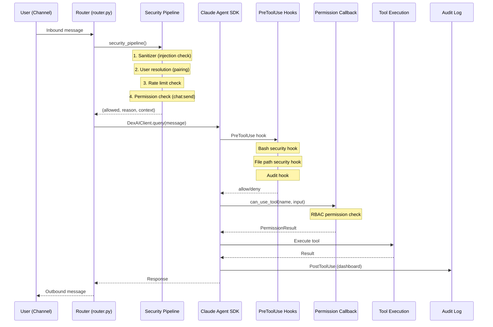

# DexAI Sandbox, Execution & Runtime Security Review

**Date:** 2026-02-11
**Reviewer:** Agent 3 — Security Specialist (Sandbox, Execution & Runtime)

---

## Research Baseline

### Industry Reference Points (2025-2026)

| Reference | Key Finding | DexAI Relevance |
|-----------|-------------|-----------------|
| [NVIDIA Sandbox Guidance](https://developer.nvidia.com/blog/practical-security-guidance-for-sandboxing-agentic-workflows-and-managing-execution-risk/) | MicroVMs (Firecracker) and gVisor provide strongest isolation; containers alone insufficient for untrusted code | DexAI uses hook-based sandboxing, not OS-level isolation |
| [OWASP Agentic Top 10 2026](https://genai.owasp.org/resource/owasp-top-10-for-agentic-applications-for-2026/) | Tool misuse, prompt injection, and data leakage are top agentic risks | DexAI addresses prompt injection and tool misuse, but gaps exist |
| [Docker Sandboxes for Claude Code](https://www.docker.com/blog/docker-sandboxes-run-claude-code-and-other-coding-agents-unsupervised-but-safely/) | Sandboxed agents reduce security incidents 90% vs unrestricted access | DexAI sandbox is opt-in, not default-on |
| [Claude Agent SDK Sandboxing](https://code.claude.com/docs/en/sandboxing) | Filesystem + network isolation via bubblewrap (Linux) / Seatbelt (macOS) | DexAI configures SDK sandbox but with permissive defaults |
| [MCP Security Vulnerabilities](https://www.practical-devsecops.com/mcp-security-vulnerabilities/) | 43% of MCP servers had command injection flaws; tool poisoning is critical risk | DexAI MCP tools are in-process (lower risk) but still need hardening |
| [Elastic MCP Defense](https://www.elastic.co/security-labs/mcp-tools-attack-defense-recommendations) | Defense-in-depth: input validation, output filtering, least-privilege | DexAI has input validation but lacks output filtering |
| [Agent Zero Docker](https://github.com/agent0ai/agent-zero/blob/main/docs/installation.md) | Full Linux system in Docker with dedicated network isolation | DexAI lacks Docker-level isolation per user |
| [Python Supply Chain 2025](https://www.artefact.com/blog/how-to-secure-your-python-software-supply-chain/) | Typosquatting and dependency confusion are primary PyPI attack vectors | DexAI has typosquat detection but lacks hash pinning |

---

## Execution Flow Analysis

### Tool Invocation Path (Request to Result)



### Trust Boundary Map

```
┌──────────────────────────────────────────────────────────────────────┐
│ UNTRUSTED ZONE (User Input)                                         │
│  ┌────────────┐  ┌────────────┐  ┌────────────┐  ┌────────────┐   │
│  │  Telegram   │  │  Discord   │  │   Slack    │  │  Web Chat  │   │
│  └──────┬─────┘  └──────┬─────┘  └──────┬─────┘  └──────┬─────┘   │
│         │               │               │               │          │
│         └───────────────┼───────────────┼───────────────┘          │
│                         │               │                           │
├─── TRUST BOUNDARY 1 ───▼───────────────▼─── (Input Sanitization) ──┤
│                                                                      │
│ SEMI-TRUSTED ZONE (Validated Input)                                  │
│  ┌────────────────────────────────────────────────────────────┐     │
│  │  Security Pipeline (router.py)                             │     │
│  │  ├─ Sanitizer → Rate Limiter → RBAC → User Resolution     │     │
│  └────────────────────────────┬───────────────────────────────┘     │
│                               │                                      │
├─── TRUST BOUNDARY 2 ─────────▼─── (SDK + Hooks) ───────────────────┤
│                                                                      │
│ TRUSTED ZONE (Agent Execution)                                       │
│  ┌─────────────────────────────────────────────────────┐            │
│  │  Claude Agent SDK                                    │            │
│  │  ├─ PreToolUse Hooks (bash security, path security) │            │
│  │  ├─ Permission Callback (RBAC)                       │            │
│  │  ├─ Sandbox (bubblewrap - if enabled)               │            │
│  │  └─ MCP Tools (in-process DexAI tools)              │            │
│  └──────────────┬──────────────────────────────────────┘            │
│                 │                                                     │
├── TRUST BOUNDARY 3 ──▼── (Workspace Boundary) ──────────────────────┤
│                                                                      │
│ SENSITIVE ZONE (Data & Secrets)                                      │
│  ┌──────────┐  ┌──────────┐  ┌──────────┐  ┌──────────┐           │
│  │  Vault   │  │ Memory   │  │  Config  │  │ .env     │           │
│  │ (AES256) │  │ (SQLite) │  │  (YAML)  │  │ (keys)   │           │
│  └──────────┘  └──────────┘  └──────────┘  └──────────┘           │
└──────────────────────────────────────────────────────────────────────┘
```

---

## Trust Model Assessment

### Trust Layers

| Layer | What | Trust Level | Controls |
|-------|------|-------------|----------|
| User Input | Channel messages, file uploads | **Untrusted** | Sanitizer, rate limiter |
| Security Pipeline | Validated messages | **Semi-trusted** | RBAC, pairing check |
| SDK Agent | Claude + tools | **Trusted** | Hooks, permission callback, sandbox |
| MCP Tools (DexAI) | In-process tools | **Trusted** | Permission mapping, RBAC |
| MCP Tools (External) | Not currently used | **N/A** | Would need isolation |
| Subagents | Task-decomposer, etc. | **Trusted** | Limited tool set, haiku model |
| Skills (Agent-created) | .claude/skills/ | **Semi-trusted** | File writes only, no code execution |
| Workspace Files | Per-user bootstrap files | **Trusted** | Template-based creation |
| Secrets Vault | Encrypted credentials | **Highly trusted** | AES-256-GCM, master key |

### Key Trust Gaps

1. **Agent-created skills have no execution sandbox** — Skills are markdown instructions, but the agent can create arbitrary files in `.claude/skills/` with `allow_self_modification: true`. A prompt injection could poison skill instructions.

2. **No tool output validation** — Tool results pass directly to the LLM without sanitization. A compromised memory entry or fetched web content could contain prompt injection payloads that influence subsequent tool calls.

3. **MCP tools are in-process** — While this avoids network-level MCP attacks, it means a vulnerability in any MCP tool function has full process access (memory, environment variables).

---

## Sandbox & Isolation

### SDK Sandbox Configuration

**File:** `args/agent.yaml:154-182`

```yaml
sandbox:
  enabled: true
  auto_allow_bash_if_sandboxed: true
  excluded_commands: [docker, git, uv, npm, bun]
  allow_unsandboxed_commands: true    # <-- CRITICAL
  network:
    allow_local_binding: true
    allow_unix_sockets: []
```

#### Findings

| # | Finding | Severity | File:Line |
|---|---------|----------|-----------|
| S-1 | `allow_unsandboxed_commands: true` effectively disables sandbox enforcement. Any command can request to bypass sandbox. | **Critical** | `args/agent.yaml:173` |
| S-2 | `excluded_commands` list bypasses sandbox for `docker`, `git`, `uv`, `npm`, `bun`. `docker` in particular grants container escape capability. | **High** | `args/agent.yaml:165-169` |
| S-3 | Sandbox is enabled in config but `sdk_client.py:623` only applies it when `sandbox_config.get("enabled", False)` — default is `False`, meaning sandbox is opt-in even though config says `true`. The config and code default disagree. | **Medium** | `tools/agent/sdk_client.py:623` |
| S-4 | No process-level isolation. All users share the same Python process and filesystem namespace. Workspace directories are convention-based, not OS-enforced. | **High** | Architecture |
| S-5 | `auto_allow_bash_if_sandboxed: true` auto-approves all Bash commands when sandbox is active, reducing RBAC effectiveness for system:execute operations. | **Medium** | `args/agent.yaml:160` |

### Hook-Based Security

**File:** `tools/agent/hooks.py`

The security hooks provide defense-in-depth via `PreToolUse`:

1. **Bash Security Hook** (`hooks.py:284-313`) — Pattern-matched blocklist for dangerous commands
2. **File Path Security Hook** (`hooks.py:425-519`) — Blocks writes to protected paths and path traversal

#### Findings

| # | Finding | Severity | File:Line |
|---|---------|----------|-----------|
| S-6 | Bash blocklist is regex-based and can be bypassed. E.g., `rm -rf /` is blocked but `find / -delete` is not. `bash -c "rm -rf /"` with quotes/encoding could bypass patterns. | **High** | `tools/agent/hooks.py:284-313` |
| S-7 | Protected paths list (`/etc/`, `/usr/`, etc.) doesn't include `/tmp/` or `/home/` (other users). Agent can read/write anywhere not in the list. | **Medium** | `tools/agent/hooks.py:326-338` |
| S-8 | Path traversal check only triggers if `..` is in the path. Symlinks (`/workspace/link -> /etc/passwd`) would bypass this check entirely. | **Medium** | `tools/agent/hooks.py:463` |
| S-9 | `Read` is included in file path security matcher (`hooks.py:450`), but reading protected paths like `~/.ssh/` is only logged, not blocked — the hook blocks `Write|Edit|NotebookEdit|Read` but the bash `cat` command bypasses this entirely. | **Medium** | `tools/agent/hooks.py:450` |

### Workspace Isolation

**File:** `tools/agent/workspace_manager.py`

| # | Finding | Severity | File:Line |
|---|---------|----------|-----------|
| S-10 | Workspace isolation is directory-naming-based only. No OS-level filesystem restrictions. Agent can access any path — workspace is just the `cwd`. | **High** | `tools/agent/workspace_manager.py:206-239` |
| S-11 | Workspace key uses simple character sanitization but no length limit. Extremely long user IDs could cause path length issues. | **Low** | `tools/agent/workspace_manager.py:176-179` |
| S-12 | Workspace restrictions (`max_file_size_bytes`, `blocked_extensions`) in `workspace.yaml:57-74` are declared but **never enforced in code**. The `WorkspaceManager` class only checks total workspace size, not individual file sizes or extensions. | **High** | `args/workspace.yaml:57-74`, `tools/agent/workspace_manager.py` |

---

## Prompt Injection Defenses

### Input Sanitization

**File:** `tools/security/sanitizer.py`

The sanitizer provides a solid foundation with:
- 27 injection pattern categories (prompt injection, jailbreak, exfiltration, code injection)
- Unicode NFC normalization (prevents homograph attacks)
- HTML stripping (XSS prevention)
- Max length enforcement (10KB default)

#### Findings

| # | Finding | Severity | File:Line |
|---|---------|----------|-----------|
| PI-1 | **Sanitizer detects but doesn't block by default.** `calculate_risk_level()` returns risk levels, but the router (`router.py:344-345`) only blocks "block" and "escalate" recommendations. "Medium" risk (`sanitize` recommendation) only logs — injection patterns with medium severity pass through. | **High** | `tools/security/sanitizer.py:212-222`, `tools/channels/router.py:344-345` |
| PI-2 | **No output sanitization.** Tool results (memory search, web fetch, file content) are passed directly to the LLM. An attacker who can write to memory can embed prompt injection payloads that execute on retrieval. | **Critical** | Architecture-wide |
| PI-3 | Backtick detection pattern (`` `[^`]+` ``) will generate false positives for code snippets, which are common in ADHD productivity contexts. | **Low** | `tools/security/sanitizer.py:118` |
| PI-4 | Pattern `r"^(system|assistant|user)\s*:"` only checks line start (`^`), so injections after newlines in a multi-line message would be missed. | **Medium** | `tools/security/sanitizer.py:102` |
| PI-5 | **No indirect prompt injection defense for tool outputs.** When the agent fetches web content via `WebFetch` or reads files, injected instructions could manipulate agent behavior. Industry best practice is to wrap tool outputs in isolation markers. | **High** | Architecture |
| PI-6 | System prompt extraction patterns are detection-only. The agent's system prompt is not treated as a secret — it includes user memory, commitments, energy level, and skill authorization instructions that could be extracted. | **Medium** | `tools/agent/sdk_client.py:246-458` |

### Channel-Specific Defenses

| # | Finding | Severity | File:Line |
|---|---------|----------|-----------|
| PI-7 | The router's sanitization applies the same pipeline for all channels. Channel-specific attack vectors (e.g., Telegram markdown, Discord embeds, Slack Block Kit) receive no platform-specific filtering. | **Medium** | `tools/channels/router.py:336-356` |

---

## Credential Isolation

### Vault Architecture

**File:** `tools/security/vault.py`

Strong encryption at rest:
- AES-256-GCM (authenticated encryption)
- PBKDF2 with 100K iterations for key derivation
- Per-installation salt (stored on filesystem)
- Access audit logging

#### Findings

| # | Finding | Severity | File:Line |
|---|---------|----------|-----------|
| CI-1 | **Vault salt stored as plaintext file** (`data/.vault_salt`). If an attacker gains filesystem read access (via agent tools), they can extract the salt. Combined with a weak master key, this enables offline brute-force. | **Medium** | `tools/security/vault.py:54`, `vault.py:63-73` |
| CI-2 | **`inject_env()` loads all secrets into `os.environ`** — the entire Python process (including all MCP tools and subagents) can access all decrypted secrets via environment variables. No namespace scoping of injected secrets. | **High** | `tools/security/vault.py:410-457` |
| CI-3 | Vault CLI `main()` prints the decrypted value to stdout (`vault.py:553`). If the agent's Bash tool runs `python tools/security/vault.py --action get --key ANTHROPIC_API_KEY`, the API key appears in tool output visible to the LLM. | **High** | `tools/security/vault.py:553` |
| CI-4 | **No secret rotation mechanism.** Despite the CLI comment mentioning `--action rotate-key`, this action is not implemented. | **Low** | `tools/security/vault.py:19` |
| CI-5 | `.env` file is accessible to the agent via file read tools. The file path security hook doesn't block reading `.env` at the project root (only `cat .*/\.env` from root paths). | **Medium** | `tools/agent/hooks.py:300` |

### Environment Variable Exposure

| # | Finding | Severity | File:Line |
|---|---------|----------|-----------|
| CI-6 | `OPENROUTER_API_KEY`, `ANTHROPIC_API_KEY`, and other secrets are passed via SDK `env` parameter (`sdk_client.py:584-686`). These end up in the agent subprocess environment, accessible to any Bash command. | **Medium** | `tools/agent/sdk_client.py:584-601` |

---

## Network Security

### Egress Filtering

| # | Finding | Severity | File:Line |
|---|---------|----------|-----------|
| N-1 | **No egress filtering.** The sandbox network config allows `allow_local_binding: true` and empty `allow_unix_sockets`, but there's no allowlist or blocklist for outbound HTTP connections. The agent can make requests to any URL via `WebFetch`, `Bash` (curl), or tool code. | **High** | `args/agent.yaml:176-182` |
| N-2 | **No domain allowlist for WebFetch/WebSearch.** A compromised prompt could exfiltrate data via `WebFetch` to an attacker-controlled URL. | **High** | Architecture |
| N-3 | Image generation (`generate_image` tool) calls out to OpenAI's DALL-E API. The prompt sent to DALL-E is user-controlled and could contain PII or sensitive content. | **Medium** | `tools/agent/sdk_tools.py:382-395` |

### OAuth Flows

| # | Finding | Severity | File:Line |
|---|---------|----------|-----------|
| N-4 | Office tools (email, calendar) accept `account_id` as a parameter. No validation that the requesting user owns the account. A prompt injection could craft tool calls to access another user's email. | **High** | `tools/agent/sdk_tools.py:272-360` |

---

## Supply Chain Security

### Package Security Verification

**File:** `tools/security/package_security.py`

Good foundations:
- Known malicious package blocklist (~25 entries)
- Typosquatting detection (difflib similarity >0.85)
- PyPI existence check
- Download count validation (>1000)

#### Findings

| # | Finding | Severity | File:Line |
|---|---------|----------|-----------|
| SC-1 | **Static blocklist only.** The malicious packages list is hardcoded and contains ~25 entries. The actual PyPI malware ecosystem has thousands of malicious packages. No integration with dynamic threat feeds (e.g., PyPI advisory API, OSV). | **Medium** | `tools/security/package_security.py:40-68` |
| SC-2 | **`skip_verification: bool` parameter on `dexai_install_package`** allows bypassing all security checks. A prompt injection could invoke `install_package` with `skip_verification=True`. | **Critical** | `tools/agent/mcp/dependency_tools.py:248`, `tools/agent/sdk_tools.py:436` |
| SC-3 | **Fallback to `pip` when `uv` fails** (`dependency_tools.py:327-333`). The pip fallback doesn't repeat security verification and could install from different sources than intended. | **Medium** | `tools/agent/mcp/dependency_tools.py:327-333` |
| SC-4 | **No hash pinning or lock file.** Packages are installed by name and optional version constraint only. No verification of package integrity (checksums, signatures). | **Medium** | `tools/agent/mcp/dependency_tools.py:314-334` |
| SC-5 | **Typosquat detection covers only 35 popular packages.** Vast majority of legitimate but less popular packages have no typosquat protection. | **Low** | `tools/security/package_security.py:72-110` |
| SC-6 | `subprocess.run()` with `timeout=120` for installation. During this window, a malicious package's `setup.py` has full code execution in the process context. | **High** | `tools/agent/mcp/dependency_tools.py:318-323` |

### Dependency Installation Flow

```mermaid
flowchart TD
    A[Agent wants package] --> B{Check user preference}
    B -->|ask| C[Ask user via AskUserQuestion]
    B -->|always| D[Verify package]
    B -->|never| E[Suggest code-only alternative]
    C -->|approved| D
    D --> F{Blocklist check}
    F -->|blocked| G[Reject]
    F -->|not blocked| H{Typosquat check}
    H -->|suspicious| I{Risk > 40?}
    I -->|yes| G
    I -->|no| J[Warn but allow]
    H -->|clean| K{PyPI exists?}
    K -->|no| G
    K -->|yes| L{Download count?}
    L -->|<1000| M[Medium risk]
    L -->|>1000| N[Low risk - install]
    J --> N
    M --> N
    N --> O[uv pip install]
    O -->|fail| P[pip install fallback]

    style A fill:#f9f,stroke:#333
    style G fill:#f66,stroke:#333
    style N fill:#6f6,stroke:#333
    style SC2[skip_verification=True] fill:#f66
```

**Critical Gap:** The `skip_verification` parameter creates a bypass path from A directly to O, skipping all security checks.

---

## Threat Model

### Top 10 Attack Vectors (Ranked by Severity x Likelihood)

| Rank | Attack Vector | Severity | Likelihood | Impact | File Reference |
|------|---------------|----------|------------|--------|----------------|
| 1 | **Indirect prompt injection via memory/tool output** — Attacker writes malicious instructions to memory; agent retrieves and follows them | Critical | High | Full agent compromise, data exfiltration | PI-2, PI-5 |
| 2 | **Package installation with `skip_verification=True`** — Prompt injection triggers installing malicious package | Critical | Medium | RCE in application context | SC-2 |
| 3 | **`allow_unsandboxed_commands: true` bypass** — Any Bash command can run unsandboxed | Critical | Medium | Full system access | S-1 |
| 4 | **Data exfiltration via WebFetch** — Compromised agent sends secrets to attacker-controlled URL | High | Medium | API key theft, PII leak | N-1, N-2, CI-2 |
| 5 | **Vault CLI secret extraction** — Agent runs vault CLI to print API keys to stdout | High | Medium | Credential theft | CI-3 |
| 6 | **Cross-user email access via office tools** — account_id not validated against requesting user | High | Medium | Email data breach | N-4 |
| 7 | **Bash blocklist bypass** — Encoded/aliased commands evade regex patterns | High | Medium | Arbitrary command execution | S-6 |
| 8 | **Environment variable harvesting** — Agent reads `os.environ` containing injected secrets | High | Low | Credential theft | CI-2, CI-6 |
| 9 | **Workspace escape via symlinks** — Create symlink in workspace pointing to sensitive path | Medium | Medium | Data access outside workspace | S-8, S-10 |
| 10 | **Skill poisoning** — Inject malicious instructions into `.claude/skills/` to affect future sessions | Medium | Medium | Persistent prompt injection | Trust model gap |

---

## Vulnerability Inventory

### Critical Severity (CVSS 9.0+)

| ID | Vulnerability | CVSS | Component | Status |
|----|--------------|------|-----------|--------|
| V-1 | No output sanitization for tool results — indirect prompt injection | 9.3 | Architecture | **Open** |
| V-2 | `skip_verification` parameter enables unverified package installation | 9.1 | `dependency_tools.py:248` | **Open** |
| V-3 | `allow_unsandboxed_commands: true` effectively disables sandbox | 9.0 | `args/agent.yaml:173` | **Open** |

### High Severity (CVSS 7.0-8.9)

| ID | Vulnerability | CVSS | Component | Status |
|----|--------------|------|-----------|--------|
| V-4 | No egress filtering — data exfiltration possible | 8.5 | Architecture | **Open** |
| V-5 | Vault `inject_env()` exposes all secrets to process | 8.2 | `vault.py:410-457` | **Open** |
| V-6 | Vault CLI prints decrypted secrets to stdout | 8.0 | `vault.py:553` | **Open** |
| V-7 | Bash regex blocklist bypasses (encoding, aliasing) | 7.8 | `hooks.py:284-313` | **Open** |
| V-8 | Workspace restrictions declared but unenforced | 7.5 | `workspace_manager.py` | **Open** |
| V-9 | Office tools lack account ownership validation | 7.5 | `sdk_tools.py:272-360` | **Open** |
| V-10 | No workspace OS-level isolation | 7.2 | `workspace_manager.py` | **Open** |
| V-11 | `docker` in sandbox excluded_commands enables container escape | 7.0 | `args/agent.yaml:166` | **Open** |
| V-12 | Package install runs `setup.py` with full process context | 7.0 | `dependency_tools.py:318` | **Open** |
| V-13 | No indirect prompt injection defense for WebFetch/file reads | 7.0 | Architecture | **Open** |

### Medium Severity (CVSS 4.0-6.9)

| ID | Vulnerability | CVSS | Component | Status |
|----|--------------|------|-----------|--------|
| V-14 | Sanitizer medium-risk patterns log-only, don't block | 6.5 | `sanitizer.py:212-222` | **Open** |
| V-15 | Symlink path traversal bypass | 6.2 | `hooks.py:463` | **Open** |
| V-16 | Protected paths list incomplete (no /tmp, /home) | 5.8 | `hooks.py:326-338` | **Open** |
| V-17 | Vault salt stored as plaintext file | 5.5 | `vault.py:54` | **Open** |
| V-18 | `.env` file readable by agent | 5.5 | Architecture | **Open** |
| V-19 | SDK sandbox default is `False` in code despite config saying `true` | 5.0 | `sdk_client.py:623` | **Open** |
| V-20 | Static malicious package blocklist (~25 entries) | 5.0 | `package_security.py:40-68` | **Open** |
| V-21 | System prompt contains sensitive user data (memory, commitments) | 4.8 | `sdk_client.py:246-458` | **Open** |
| V-22 | DALL-E prompt may contain PII | 4.5 | `sdk_tools.py:382-395` | **Open** |
| V-23 | Auto-allow bash if sandboxed reduces RBAC value | 4.0 | `args/agent.yaml:160` | **Open** |

### Low Severity (CVSS 1.0-3.9)

| ID | Vulnerability | CVSS | Component | Status |
|----|--------------|------|-----------|--------|
| V-24 | No secret rotation mechanism | 3.0 | `vault.py` | **Open** |
| V-25 | Backtick regex false positives on code snippets | 2.5 | `sanitizer.py:118` | **Open** |
| V-26 | Workspace key no length limit | 2.0 | `workspace_manager.py:176` | **Open** |

---

## Comparison

### DexAI Sandbox vs Industry Approaches

| Feature | DexAI | Agent Zero (Docker) | Letta/MemGPT | Claude Code (Docker Sandbox) | Best Practice |
|---------|-------|--------------------|--------------|-----------------------------|---------------|
| **Isolation tech** | Hook-based + SDK bubblewrap | Full Docker container | Sandboxed tool execution | Docker + bubblewrap | MicroVM (Firecracker) |
| **Per-user isolation** | Directory naming | Separate containers | Per-agent memory | Per-session container | Separate namespace/cgroup |
| **Network isolation** | None (open egress) | Docker network rules | API proxy | Domain allowlist | Zero-trust egress |
| **Filesystem isolation** | Convention-based | Docker volumes | API-mediated | bubblewrap chroot | Read-only root + overlay |
| **Bash execution** | Regex blocklist | Docker containment | Not allowed | bubblewrap sandbox | Seccomp + AppArmor |
| **Package installation** | Blocklist + typosquat check | Controlled via Dockerfile | Not supported | Not supported | Hash pinning + SBOM |
| **Prompt injection defense** | Input sanitization only | None documented | None documented | Human-in-the-loop | Input + output + isolation |
| **Credential scoping** | Vault (all-or-nothing env) | Docker env vars | API-key scoped | Per-session env | Per-tool secret scoping |
| **Tool output filtering** | None | None | Summarization layer | None | Output sanitization |
| **Audit trail** | SQLite audit log | Docker logs | In-memory | Filesystem | Tamper-evident log |

### Key Differentiators

**DexAI Strengths:**
- Comprehensive RBAC with 5 role tiers
- PreToolUse hooks for defense-in-depth
- Package security verification (typosquat + blocklist)
- Detailed audit logging with dashboard integration
- Rate limiting with cost tracking
- Performance monitoring for hooks

**DexAI Gaps vs Best Practice:**
- No OS-level process isolation (vs Docker/MicroVM)
- No egress filtering (vs zero-trust network)
- No tool output sanitization (critical gap)
- Convention-based workspace isolation (vs chroot/cgroup)
- Regex-based command blocking (vs seccomp/AppArmor)

---

## Hardening Roadmap

### Phase 1: Quick Wins (1-2 weeks, Low complexity)

| Priority | Action | Addresses | Complexity | Impact |
|----------|--------|-----------|------------|--------|
| P0 | **Set `allow_unsandboxed_commands: false`** in `args/agent.yaml` | V-3 | Config change | Critical |
| P0 | **Remove `skip_verification` parameter** from `dexai_install_package` or make it admin-only | V-2, SC-2 | Code change (1 file) | Critical |
| P0 | **Fix sandbox default** — change `sdk_client.py:623` default from `False` to `True` | V-19 | Code change (1 line) | High |
| P1 | **Remove `docker` from excluded_commands** unless explicitly needed | V-11 | Config change | High |
| P1 | **Remove vault CLI secret printing** — never print decrypted values to stdout | V-6 | Code change (1 file) | High |
| P1 | **Add symlink resolution** to path traversal check in `file_path_security_hook` | V-15 | Code change (~10 lines) | Medium |
| P2 | **Block `.env` reads** in file path security hook | V-18 | Code change (~3 lines) | Medium |
| P2 | **Expand protected paths** to include `/tmp/`, `/home/` (other users) | V-16 | Code change (~2 lines) | Medium |

### Phase 2: Core Hardening (2-4 weeks, Medium complexity)

| Priority | Action | Addresses | Complexity | Impact |
|----------|--------|-----------|------------|--------|
| P0 | **Implement tool output sanitization** — wrap all tool outputs in delimiters and scan for injection patterns before passing to LLM | V-1, V-13, PI-2, PI-5 | New module + integration | Critical |
| P1 | **Add egress allowlist** — configure SDK network proxy with domain allowlist for WebFetch | V-4, N-1, N-2 | Module + config | High |
| P1 | **Scope vault secret injection** — inject only secrets needed for current operation, not entire namespace | V-5 | Code refactor (~50 lines) | High |
| P1 | **Enforce workspace restrictions** — implement file size, extension, and total size checks in hooks | V-8 | Code change (~100 lines) | High |
| P1 | **Validate office tool account ownership** — check that requesting user owns the account_id | V-9, N-4 | Code change (~30 lines) | High |
| P2 | **Upgrade bash security from regex to AST-based** — parse commands before execution instead of regex matching | V-7, S-6 | New module (~200 lines) | High |
| P2 | **Add process-level workspace isolation** — use `unshare` or cgroup namespaces for per-user sessions | V-10 | Architecture change | High |

### Phase 3: Advanced Defenses (4-8 weeks, High complexity)

| Priority | Action | Addresses | Complexity | Impact |
|----------|--------|-----------|------------|--------|
| P1 | **Container-based execution** — run each user session in a Docker container with resource limits and network policy | V-10, N-1, S-4 | Architecture change | Critical |
| P1 | **Dynamic malicious package feed** — integrate OSV/PyPI advisory API for real-time blocklist updates | V-20, SC-1 | New integration | Medium |
| P2 | **Package hash pinning** — verify package integrity with checksums from PyPI JSON API | SC-4 | Code change (~50 lines) | Medium |
| P2 | **Skill integrity verification** — hash and sign agent-created skills, verify before loading | Skill poisoning | New module | Medium |
| P2 | **Secret rotation mechanism** — implement `rotate-key` action for vault | V-24 | Code change (~100 lines) | Low |
| P3 | **Formal security testing** — fuzzing of sanitizer patterns, penetration testing of hook bypasses | All | Testing effort | High |
| P3 | **Tamper-evident audit log** — chain hashing or append-only storage for audit events | Integrity | Architecture change | Medium |

---

## Summary

DexAI demonstrates security-conscious design with a multi-layered defense model (sanitizer + rate limiter + RBAC + hooks + sandbox + audit). The architecture follows separation of concerns well, with clear trust boundaries between channels, the security pipeline, and the agent execution layer.

**However, three critical gaps need immediate attention:**

1. **No tool output sanitization** (V-1) — The most impactful gap. Indirect prompt injection via memory, web content, or file reads is the #1 threat to agentic systems in 2026 per OWASP. Every tool output should be wrapped in isolation markers and scanned.

2. **`allow_unsandboxed_commands: true`** (V-3) and **sandbox default mismatch** (V-19) — The sandbox infrastructure exists but is effectively disabled. Flipping two configuration values dramatically improves security posture.

3. **`skip_verification` bypass** (V-2) — The package installation security is well-designed but includes an explicit bypass parameter that a prompt injection could exploit.

The hook-based security system (`hooks.py`) is a pragmatic solution for the current architecture, but should be viewed as a transitional layer toward OS-level isolation (Docker/MicroVM) for production multi-user deployments. The regex-based command blocking is a known weak pattern that sophisticated attackers can bypass.

**Positive highlights:**
- Vault encryption (AES-256-GCM + PBKDF2) is industry-standard
- RBAC system is well-structured with proper permission inheritance
- Rate limiting with cost tracking provides economic abuse prevention
- Audit logging is comprehensive and feeds the dashboard
- Package security verification (typosquat + blocklist) is ahead of many competitors
- Hook performance monitoring enables proactive degradation detection

---

*This review was conducted as a static code analysis. Dynamic testing (fuzzing, penetration testing) is recommended to validate findings and discover additional vulnerabilities.*
