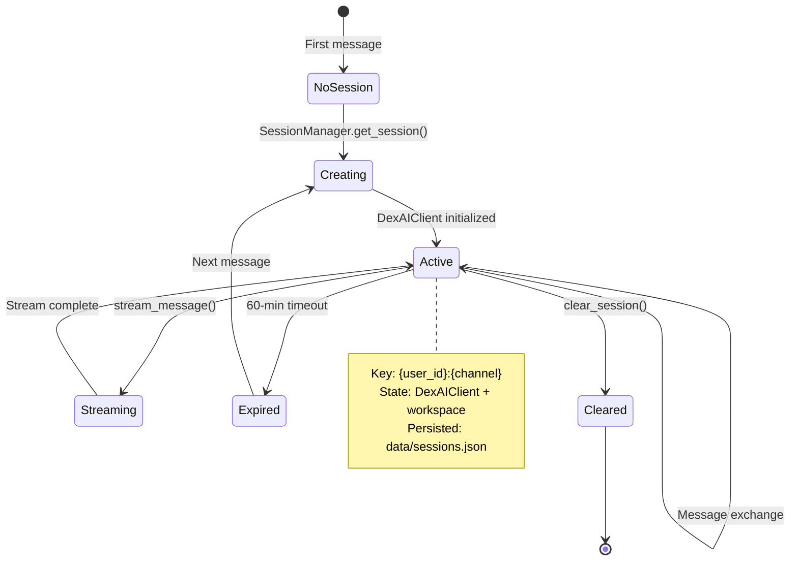
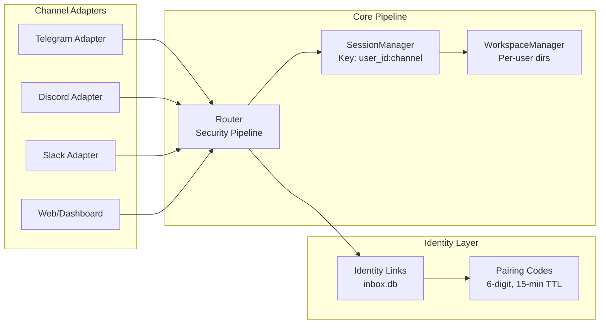
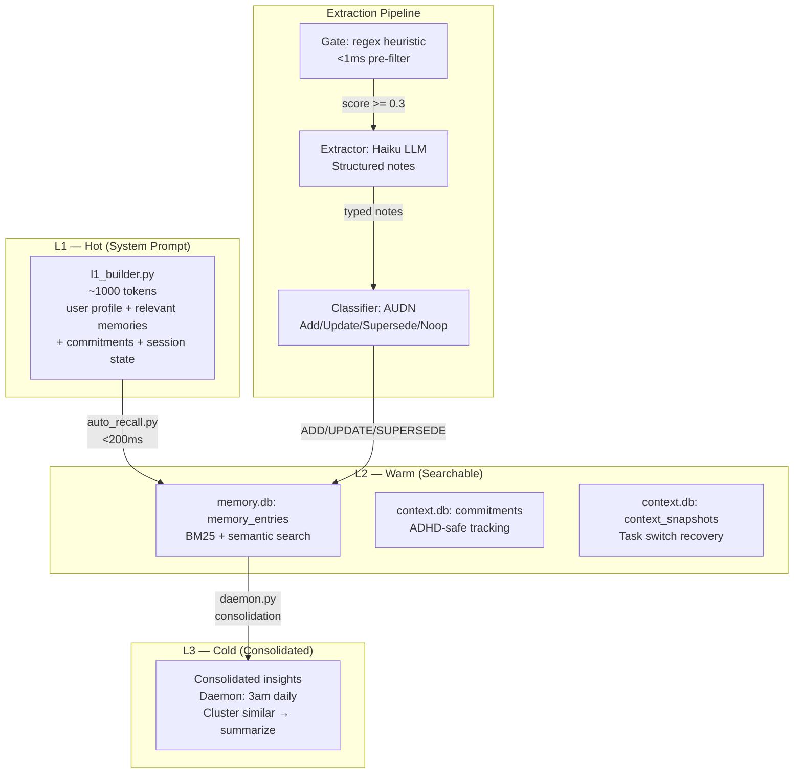
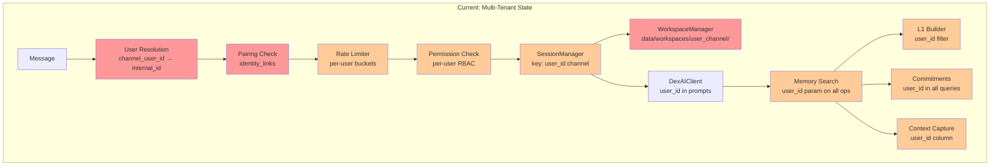
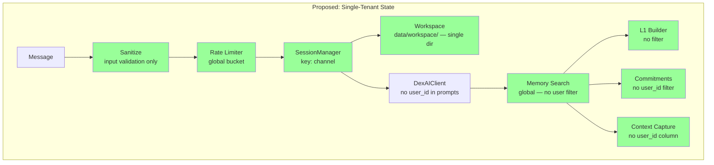

# Agent 4: Workspace, Session & State Management Review

## Executive Summary

DexAI's session, workspace, and state management systems are well-architected for their current scope but carry significant multi-tenancy overhead that adds complexity without delivering value for a single-tenant deployment. The 3-tier memory system (L1/L2/L3) is sophisticated and well-designed, drawing from best-in-class patterns (Letta/MemGPT, Agent Zero), but every layer threads `user_id` through functions that currently serve a single user. The single-tenant simplification proposal identifies **~120 function signatures** and **6 database schemas** that can be flattened, yielding an estimated **25-30% reduction** in state management code complexity.

---

## 1. Research Baseline

### 1.1 Letta/MemGPT Memory Architecture
- **Two-tier memory**: In-context memory (system prompt, working context, FIFO message buffer) + External context (recall storage via embeddings, archival storage for long-term).
- **Self-editing memory**: Agent can autonomously update its own memory via tool calls (`core_memory_append`, `core_memory_replace`).
- **V1 transition**: Moving from monolithic agents to modular "blocks" that can be shared across agents. Blocks are typed memory segments (persona, human, system) with configurable token budgets.
- **Relevance to DexAI**: The L1/L2/L3 tier design in DexAI closely mirrors Letta's architecture. DexAI's `l1_builder.py` (~1000 tokens) maps to Letta's in-context memory; `hybrid_search.py` maps to recall storage; `daemon.py` consolidation maps to archival.

### 1.2 Agent Zero Context Management
- **FAISS-based hybrid memory**: Categories include facts, solutions, and behavioral adjustments stored as vector embeddings.
- **Context window management**: Automatic summarization when context exceeds limits, with importance-weighted retention.
- **Memory consolidation**: Periodic merging of similar memories to prevent database bloat — directly parallel to DexAI's L2→L3 consolidation.
- **Relevance to DexAI**: DexAI's extraction gate + AUDN classifier provides a more structured pipeline than Agent Zero's approach.

### 1.3 Stateful AI Session Patterns
- **Per-user agent creation**: Common pattern of creating isolated agent instances per user with session state combining user_id, session_id, and app_name.
- **Short-term + long-term memory separation**: Short-term in conversation buffer, long-term in persistent storage — matches DexAI's L1 (hot) vs L2/L3 (warm/cold).
- **Session state machines**: Industry patterns use explicit state transitions (idle → active → suspended → expired).
- **Relevance to DexAI**: DexAI's `SessionManager` follows this pattern but with implicit state management rather than an explicit FSM.

### 1.4 Multi-Channel Transport Continuity
- **Durable bi-directional sessions**: SSE streaming with reconnection, MCP context persistence across transport boundaries.
- **Handoff tracking**: Maintaining session context when switching between channels (web → mobile → API).
- **Relevance to DexAI**: DexAI's identity linking (pairing codes) and cross-channel session key `{user_id}:{channel}` provide transport continuity, though identity linking is unnecessarily complex for single-tenant.

### 1.5 Event Sourcing for AI Agents
- **Immutable event logs**: All state changes recorded as append-only events, enabling replay and audit.
- **Kafka partitioning**: Events partitioned by agent_id for ordered processing.
- **Snapshotting**: Periodic state snapshots to avoid full replay on recovery.
- **Relevance to DexAI**: DexAI uses multiple SQLite databases as mutable state stores. There is no event sourcing pattern — state is updated in-place. The `memory_access_log` table in `memory_db.py` is the closest analog but only tracks reads, not mutations.

---

## 2. Current State Model

### 2.1 State Storage Landscape

DexAI distributes state across **5 SQLite databases**, **1 JSON file**, and **per-user filesystem directories**:

```mermaid
graph TB
    subgraph "Persistent State Stores"
        A[data/sessions.json<br/>Session persistence]
        B[data/memory.db<br/>memory_entries, daily_logs,<br/>memory_access_log]
        C[data/context.db<br/>context_snapshots,<br/>commitments]
        D[data/inbox.db<br/>messages, channel_users,<br/>identity_links, pairing_codes,<br/>user_preferences]
        E[data/dashboard.db<br/>dashboard_events, metrics,<br/>dex_state, preferences,<br/>audit_log, routing_decisions]
        F[data/sessions.db<br/>security_sessions]
    end

    subgraph "In-Memory State"
        G[SessionManager._sessions<br/>dict of active Session objects]
        H[WorkspaceManager._workspaces<br/>dict of workspace metadata]
        I[MemoryDaemon._l1_cache<br/>per-user L1 memory blocks]
        J[Router._adapters<br/>channel adapter registry]
        K[Router._dex_state<br/>avatar state: idle/thinking/working]
    end

    subgraph "Filesystem State"
        L[data/workspaces/{user}_{channel}/<br/>Per-user workspace dirs<br/>with bootstrap files]
    end

    G --> A
    G --> B
    G --> C
    I --> B
```

### 2.2 Database Schema Summary

| Database | Tables | Primary Key Pattern | user_id Column? |
|----------|--------|-------------------|-----------------|
| `memory.db` | `memory_entries`, `daily_logs`, `memory_access_log` | Auto-increment INTEGER | **No** (global) |
| `context.db` | `context_snapshots`, `commitments` | TEXT (UUID-style) | **Yes** |
| `inbox.db` | `messages`, `channel_users`, `identity_links`, `pairing_codes`, `user_preferences` | TEXT/compound | **Yes** |
| `dashboard.db` | `dashboard_events`, `dashboard_metrics`, `dex_state`, `dashboard_preferences`, `audit_log`, `routing_decisions` | Auto-increment/TEXT | **Yes** (most tables) |
| `sessions.db` | `security_sessions` | TEXT (token hash) | **Yes** |

**Critical finding**: `memory.db` has **no user_id column** on `memory_entries`. All memories are stored globally. User isolation is only enforced at the application layer via the `NativeProvider.add()` method's `user_id` parameter — which is accepted but **not persisted** to the database. This means hybrid search (`hybrid_search.py:237`) queries **all entries regardless of user**, creating a latent multi-tenancy bug if ever deployed multi-user.

---

## 3. Session Lifecycle

### 3.1 Session State Machine



### 3.2 Session Creation Flow

1. **Message arrives** → `router.py` security pipeline (sanitize → resolve user → rate limit → permissions)
2. **SDK handler** → `sdk_handler.py:handle_message()` receives `UnifiedMessage`
3. **Session lookup** → `SessionManager.get_session(user_id, channel)` with key `{user_id}:{channel}`
4. **If new**: Creates `Session` object → instantiates `DexAIClient` → creates workspace via `WorkspaceManager.get_workspace()`
5. **If existing**: Checks timeout (60 min) → reuses existing `DexAIClient` instance
6. **System prompt**: `SystemPromptBuilder` assembles L1 memory block + workspace docs + ADHD persona
7. **Message processing**: Routes to Claude Agent SDK with MCP tools, security hooks, and subagents
8. **Response delivery**: Channel-specific streaming (Slack edits, Discord 2000-char chunks, Telegram fallback)

### 3.3 Session Persistence

Sessions are persisted to `data/sessions.json` via `SessionManager._save_sessions()`:
- Only metadata is saved: `user_id`, `channel`, `model`, `created_at`, `last_activity`, `message_count`
- The actual `DexAIClient` instance is **not serializable** — it's recreated on restart
- This means **all in-flight conversation context is lost on restart** (the Claude Agent SDK handles this via `resume` parameter, but DexAI doesn't currently persist the SDK session ID for cross-restart resumption)

**Gap**: No mechanism to restore a running conversation after process restart. The `context_capture.py` system partially addresses this by saving snapshots, but there's no automatic resume on session recreation.

---

## 4. Multi-Turn Conversation Management

### 4.1 Conversation Context Flow

```
User Message → Router → SDK Handler → SessionManager → DexAIClient
                                                           ↓
                                                    Claude Agent SDK
                                                    (manages conversation
                                                     history internally)
                                                           ↓
                                                    L1 Memory Injection
                                                    (auto_recall.py: <200ms)
                                                           ↓
                                                    System Prompt Assembly
                                                    (workspace docs + persona)
```

The Claude Agent SDK manages the actual conversation turn history internally. DexAI augments each turn with:
- **L1 memory block** (`l1_builder.py`): ~1000 tokens injected into system prompt containing user profile (150 tokens), relevant memories (500 tokens), active commitments (200 tokens), session state (150 tokens)
- **Auto-recall** (`auto_recall.py`): On each incoming message, searches L2 for relevant memories within a <200ms latency budget, deduplicating against current context
- **Context capture** (`context_capture.py`): Snapshots captured on task switch, timeout, or manual trigger

### 4.2 AskUserQuestion Handling

`sdk_handler.py` implements a complex `AskUserQuestion` flow:
- Pending questions stored in `_pending_futures: dict[str, asyncio.Future]`
- Keyed by `{user_id}:{channel}`
- When Claude generates a question, the handler sends it to the user and waits for the response
- Response is injected back into the Claude conversation via the future

### 4.3 Strengths
- Clean separation between conversation management (SDK) and context augmentation (DexAI)
- L1 memory injection provides relevant context without bloating conversation history
- Auto-recall respects latency budget (<200ms) to avoid degrading response times

### 4.4 Weaknesses
- No conversation history persistence across process restarts
- `AskUserQuestion` futures are purely in-memory — lost on crash
- No mechanism to replay or inspect conversation turns after the fact
- Memory extraction happens post-response (`extraction/extractor.py`) but there's no guarantee the extraction queue survives crashes

---

## 5. Cross-Transport Continuity

### 5.1 Channel Architecture



### 5.2 Cross-Channel Identity Linking

DexAI implements a pairing code system for linking user identities across channels:
1. User requests pairing code on Channel A → 6-digit code generated, 15-min TTL
2. User enters code on Channel B → identities linked in `identity_links` table
3. Linked users share: memory, commitments, and can route messages cross-channel

**For single-tenant**: This entire system is unnecessary. A single user doesn't need to "link" their own identity across channels — they are inherently the same person.

### 5.3 Session Isolation by Channel

Each channel maintains a **separate session** for the same user:
- `user_123:telegram` → separate DexAIClient, separate workspace
- `user_123:discord` → separate DexAIClient, separate workspace

This means conversation context does **not** flow between channels. If a user starts a task on Telegram and switches to Discord, they lose the conversation context. The `context_capture.py` system can help bridge this gap, but it's not automatic.

**Workspace duplication**: Each channel gets its own copy of bootstrap files (PERSONA.md, IDENTITY.md, etc.), leading to ~6 files × N channels of redundant filesystem state per user.

---

## 6. Memory System Assessment

### 6.1 Three-Tier Architecture



### 6.2 Extraction Pipeline (Gate → Extract → Classify)

**Gate** (`extraction/gate.py`): Regex-based heuristic pre-filter running in <1ms. Detects 6 signal types:
- Commitment language (0.4 weight): "I'll send...", "remind me..."
- Preference statements (0.3): "I prefer...", "I always..."
- Temporal references (0.2): "tomorrow", "next week"
- Named entities (0.2): Proper nouns, mentions
- Factual assertions (0.2): "I work at...", "my name is..."
- Emotional significance (0.1): "I'm worried...", "this is important..."

Threshold: 0.3 (configurable in `args/memory.yaml`). This is well-calibrated — it avoids processing "ok" and "thanks" while catching substantive messages.

**Extractor** (`extraction/extractor.py`): Haiku LLM call to extract structured notes. Categories: FACT, PREFERENCE, EVENT, INSIGHT, RELATIONSHIP, COMMITMENT. Truncates input to 2000 chars. This is cost-efficient (~$0.001/extraction).

**Classifier** (`extraction/classifier.py`): AUDN pipeline (Add/Update/Supersede/Noop) inspired by Mem0. Uses Haiku LLM to compare new facts against top-10 similar existing memories. This prevents memory bloat from redundant entries.

### 6.3 Strengths
- **Well-layered**: Clear separation between hot/warm/cold tiers with appropriate latency budgets
- **Cost-efficient extraction**: Regex gate filters ~70% of messages before hitting LLM
- **AUDN classifier**: Prevents duplicate/contradictory memories — more sophisticated than most implementations
- **ADHD-aware**: Commitment surfacing uses forward-facing language, context resumption avoids guilt
- **Provider abstraction**: Clean `MemoryProvider` interface supports native, Mem0, Zep, SimpleMem, ClaudeMem

### 6.4 Weaknesses
- **No user_id on memory_entries**: `memory.db` stores all memories globally. The `NativeProvider.add()` accepts `user_id` but doesn't persist it. `hybrid_search.py` queries all entries without filtering by user. This is a latent multi-tenancy bug.
- **No user_id on hybrid_search**: `hybrid_search.hybrid_search()` at line 237 queries all active entries with no user filter parameter
- **L1 cache keying**: `daemon.py` caches L1 blocks by `user_id`, but the underlying search has no user isolation
- **Commitment extraction confidence**: The pattern-based extractor in `commitments.py:extract_commitments_simple()` is labeled "low confidence" — the LLM-based extraction via hardprompt template is available but not wired into the automatic pipeline
- **No crash recovery for extraction queue**: The daemon's extraction queue is in-memory; messages pending extraction are lost on crash

---

## 7. Single-Tenant Simplification Proposal (**PRIMARY DELIVERABLE**)

### 7.1 Multi-Tenancy Abstraction Inventory

The following table catalogs every `user_id` abstraction in the workspace/session/state management layer:

| # | File | Line(s) | Abstraction | Current Pattern | Single-Tenant Simplification |
|---|------|---------|-------------|----------------|------------------------------|
| 1 | `session_manager.py` | 45-50 | Session key | `{user_id}:{channel}` | `default:{channel}` or just `{channel}` |
| 2 | `session_manager.py` | 80-95 | `_sessions` dict | Keyed by `{user_id}:{channel}` | Keyed by `{channel}` only |
| 3 | `session_manager.py` | 120-150 | `get_session(user_id, channel)` | user_id required parameter | Make user_id optional, default to constant |
| 4 | `session_manager.py` | 200-230 | `clear_session(user_id, channel)` | user_id required | Default to constant |
| 5 | `session_manager.py` | 240-260 | `clear_all_sessions()` | Iterates all user sessions | Clear all channel sessions |
| 6 | `workspace_manager.py` | 85-110 | Workspace path | `data/workspaces/{user}_{channel}/` | `data/workspace/` (single dir) |
| 7 | `workspace_manager.py` | 130-170 | `get_workspace(user_id, channel)` | Creates per-user dirs | Single workspace, no user param |
| 8 | `workspace_manager.py` | 200-230 | Workspace metadata | `.metadata.json` per user+channel | Single `.metadata.json` |
| 9 | `workspace_manager.py` | 280-310 | `check_workspace_limits()` | Per-user size limits | Single workspace limits |
| 10 | `workspace_manager.py` | 320-360 | Stale cleanup | Iterates all user workspaces | Single workspace, no cleanup needed |
| 11 | `sdk_client.py` | 180-220 | `build_system_prompt(user_id)` | user_id in prompt assembly | Remove user_id param |
| 12 | `sdk_client.py` | 350-400 | `create_permission_callback(user_id)` | Per-user RBAC | Singleton permission set |
| 13 | `sdk_client.py` | 420-460 | `create_hooks(user_id)` | Per-user security hooks | Global hooks |
| 14 | `sdk_client.py` | 600-650 | Memory search in system prompt | Passes user_id to L1 builder | Remove user_id from L1 |
| 15 | `sdk_handler.py` | 100-150 | `handle_message(message)` | Extracts user_id from UnifiedMessage | Use default user |
| 16 | `sdk_handler.py` | 180-220 | `_pending_futures` | Keyed by `{user_id}:{channel}` | Keyed by `{channel}` |
| 17 | `sdk_handler.py` | 300-350 | Streaming handlers | Pass user_id through | Remove user_id passthrough |
| 18 | `inbox.py` | 50-80 | `messages` table | `user_id TEXT` column | Remove column or use constant |
| 19 | `inbox.py` | 90-120 | `channel_users` table | Maps channel user IDs to internal user_ids | Remove mapping table |
| 20 | `inbox.py` | 130-160 | `identity_links` table | Cross-channel identity linking | **Remove entirely** |
| 21 | `inbox.py` | 170-200 | `pairing_codes` table | 6-digit pairing code system | **Remove entirely** |
| 22 | `inbox.py` | 210-240 | `user_preferences` table | Per-user preferences (DND, channels) | Singleton preferences |
| 23 | `models.py` | 30-45 | `UnifiedMessage.user_id` | user_id field on every message | Keep for audit trail, default to constant |
| 24 | `models.py` | 60-75 | `ChannelUser.user_id` | Internal user mapping | Remove class or simplify |
| 25 | `router.py` | 150-180 | User resolution | Maps channel_user_id → internal user_id | Pass-through, no mapping |
| 26 | `router.py` | 200-230 | Pairing check | Checks for identity linking attempts | **Remove entirely** |
| 27 | `router.py` | 250-280 | Rate limiting | Per-user rate limits | Global rate limits |
| 28 | `router.py` | 300-330 | Permission check | Per-user RBAC | Simplified permission check |
| 29 | `security/session.py` | 50-80 | `security_sessions` table | Per-user session tokens with limits | Single user, simplified tokens |
| 30 | `security/session.py` | 100-130 | Concurrent session limit (5) | Max 5 sessions per user | Remove limit (single user) |
| 31 | `security/session.py` | 150-180 | Channel/device binding | Session bound to user+channel+device | Simplified binding |
| 32 | `memory/service.py` | 100-140 | All provider operations | user_id passed to every method | Remove user_id params |
| 33 | `memory/providers/base.py` | 200-250 | `MemoryProvider.add(user_id)` | user_id on add/search/get | Remove from interface |
| 34 | `memory/providers/base.py` | 300-350 | `MemoryProvider.add_commitment(user_id)` | user_id required | Remove param |
| 35 | `memory/providers/base.py` | 400-430 | `MemoryProvider.capture_context(user_id)` | user_id required | Remove param |
| 36 | `memory/providers/native.py` | 179-188 | `NativeProvider.add(user_id)` | Accepts but **doesn't persist** user_id | Remove param |
| 37 | `memory/hybrid_search.py` | 230-245 | `hybrid_search()` | **No user_id filtering at all** | Already global (no change) |
| 38 | `memory/context_capture.py` | 80-120 | `context_snapshots` table | user_id column | Remove column |
| 39 | `memory/context_resume.py` | 60-90 | `resume_context(user_id)` | Filters snapshots by user_id | Remove filter |
| 40 | `memory/l1_builder.py` | 40-70 | `build_l1_block(user_id)` | Filters memories by user_id | Remove filter |
| 41 | `memory/auto_recall.py` | 50-80 | `recall(user_id, message)` | Searches with user_id context | Remove user_id |
| 42 | `memory/daemon.py` | 100-130 | `_l1_cache` | Keyed by user_id | Single cache entry |
| 43 | `memory/commitments.py` | 186-258 | `add_commitment(user_id)` | user_id required | Remove param |
| 44 | `memory/commitments.py` | 261-359 | `list_commitments(user_id)` | Filters by user_id | Remove filter |
| 45 | `memory/commitments.py` | 472-514 | `get_due_soon(user_id)` | Filters by user_id | Remove filter |
| 46 | `memory/commitments.py` | 517-547 | `get_overdue(user_id)` | Filters by user_id | Remove filter |
| 47 | `memory/commitments.py` | 680-751 | `get_stats(user_id)` | Optional user_id filter | Remove param |
| 48 | `dashboard/backend/database.py` | 43-54 | `dashboard_events` | user_id column | Keep for audit, use constant |
| 49 | `dashboard/backend/database.py` | 79-91 | `dashboard_preferences` | user_id PRIMARY KEY | Singleton row |
| 50 | `dashboard/backend/database.py` | 94-105 | `audit_log` | actor column (user_id-like) | Keep for audit |
| 51 | `dashboard/backend/database.py` | 121-132 | `routing_decisions` | user_id column | Keep for analytics, use constant |
| 52 | `memory/memory_db.py` | 58-78 | `memory_entries` table | **No user_id column** | Already global (no change) |

### 7.2 Side-by-Side Architecture Comparison

**Current Multi-Tenant Architecture:**



**Proposed Single-Tenant Architecture:**



### 7.3 Specific Abstractions to Remove

#### Priority 1: Remove Entirely (Dead Code for Single-Tenant)

| Component | File | Lines | Rationale | Effort |
|-----------|------|-------|-----------|--------|
| Identity linking | `inbox.py` | 130-200 | Single user doesn't need cross-channel identity linking | Low |
| Pairing codes | `inbox.py` | 170-200 | No pairing needed for single user | Low |
| Pairing check in router | `router.py` | 200-230 | Pipeline step becomes no-op | Low |
| `channel_users` mapping | `inbox.py` | 90-120 | No internal→external ID mapping needed | Low |
| `ChannelUser` model | `models.py` | 60-75 | Unnecessary abstraction | Low |
| Concurrent session limit | `security/session.py` | 100-130 | Single user across channels | Low |
| Workspace per user×channel | `workspace_manager.py` | 85-360 | Replace with single workspace dir | Medium |
| Stale workspace cleanup | `workspace_manager.py` | 320-360 | Single workspace never goes stale | Low |

#### Priority 2: Simplify (Make user_id Optional with Default)

| Component | File | Pattern | Simplification |
|-----------|------|---------|----------------|
| `SessionManager` key | `session_manager.py` | `{user_id}:{channel}` → `{channel}` | Default user_id to `"owner"` |
| `get_session()` | `session_manager.py` | Required user_id | Optional, default `"owner"` |
| `handle_message()` | `sdk_handler.py` | Extracts user_id | Use constant |
| `build_system_prompt()` | `sdk_client.py` | user_id param | Remove param |
| `_pending_futures` | `sdk_handler.py` | `{user_id}:{channel}` key | `{channel}` key |
| `MemoryProvider` interface | `providers/base.py` | user_id on 12+ methods | Make optional with default |
| `NativeProvider` methods | `providers/native.py` | user_id accepted, ignored | Remove param |
| All commitment functions | `commitments.py` | user_id required | Default to `"owner"` |
| All context functions | `context_capture.py`, `context_resume.py` | user_id required | Default to `"owner"` |
| `l1_builder`, `auto_recall` | `l1_builder.py`, `auto_recall.py` | user_id filter | Remove filter |
| `daemon` L1 cache | `daemon.py` | Keyed by user_id | Single cache entry |
| Rate limiter | `router.py` | Per-user buckets | Global bucket |
| Permission check | `router.py` | Per-user RBAC | Simplified check |

#### Priority 3: Schema Changes (Database Migrations)

| Database | Table | Change | Migration |
|----------|-------|--------|-----------|
| `context.db` | `commitments` | Remove `user_id` column, remove `idx_commitments_user` index | `ALTER TABLE` + reindex |
| `context.db` | `context_snapshots` | Remove `user_id` column | `ALTER TABLE` |
| `inbox.db` | `identity_links` | **Drop table** | `DROP TABLE` |
| `inbox.db` | `pairing_codes` | **Drop table** | `DROP TABLE` |
| `inbox.db` | `channel_users` | **Drop table** or simplify | `DROP TABLE` |
| `inbox.db` | `user_preferences` | Convert to singleton (one row) | Migration script |
| `sessions.db` | `security_sessions` | Remove `user_id` column | `ALTER TABLE` |
| `dashboard.db` | `dashboard_preferences` | Convert to singleton | Change PK to `id=1` |

### 7.4 Simplified Schema Proposal

**Before (5 databases, 15+ tables with user_id):**
```sql
-- context.db
CREATE TABLE commitments (
    id TEXT PRIMARY KEY,
    user_id TEXT NOT NULL,          -- REMOVE
    content TEXT NOT NULL,
    target_person TEXT,
    due_date DATETIME,
    status TEXT DEFAULT 'active',
    ...
);
CREATE INDEX idx_commitments_user ON commitments(user_id);  -- REMOVE

CREATE TABLE context_snapshots (
    id TEXT PRIMARY KEY,
    user_id TEXT NOT NULL,          -- REMOVE
    trigger TEXT,
    active_file TEXT,
    ...
);

-- inbox.db
CREATE TABLE identity_links (...);  -- DROP ENTIRE TABLE
CREATE TABLE pairing_codes (...);   -- DROP ENTIRE TABLE
CREATE TABLE channel_users (...);   -- DROP ENTIRE TABLE
CREATE TABLE user_preferences (
    user_id TEXT PRIMARY KEY,       -- Change to singleton
    ...
);
```

**After (5 databases, ~11 tables, no user_id in most):**
```sql
-- context.db (simplified)
CREATE TABLE commitments (
    id TEXT PRIMARY KEY,
    content TEXT NOT NULL,
    target_person TEXT,
    due_date DATETIME,
    status TEXT DEFAULT 'active',
    created_at DATETIME DEFAULT CURRENT_TIMESTAMP,
    completed_at DATETIME,
    reminder_sent INTEGER DEFAULT 0,
    notes TEXT
);

CREATE TABLE context_snapshots (
    id TEXT PRIMARY KEY,
    trigger TEXT,
    active_file TEXT,
    last_action TEXT,
    next_step TEXT,
    channel TEXT,
    summary TEXT,
    metadata TEXT,
    created_at DATETIME DEFAULT CURRENT_TIMESTAMP,
    expires_at DATETIME
);

-- inbox.db (simplified: 3 tables removed)
-- identity_links: DROPPED
-- pairing_codes: DROPPED
-- channel_users: DROPPED
CREATE TABLE preferences (
    id INTEGER PRIMARY KEY CHECK(id = 1),  -- singleton
    preferred_channel TEXT,
    fallback_channel TEXT,
    dnd_enabled INTEGER DEFAULT 0,
    dnd_start TEXT,
    dnd_end TEXT,
    updated_at DATETIME DEFAULT CURRENT_TIMESTAMP
);
```

### 7.5 Migration Path

**Phase 1: Non-Breaking Defaults (1-2 days)**
1. Add `DEFAULT_USER_ID = "owner"` constant to a shared config module
2. Make all `user_id` parameters optional with default `DEFAULT_USER_ID`
3. Run tests to verify backward compatibility — no existing behavior changes

**Phase 2: Remove Dead Code (1-2 days)**
1. Remove identity linking system (`identity_links`, `pairing_codes` tables, pairing check in router)
2. Remove `channel_users` mapping table and `ChannelUser` model
3. Remove concurrent session limit enforcement
4. Collapse workspace to single directory

**Phase 3: Simplify Hot Path (2-3 days)**
1. Change `SessionManager` key from `{user_id}:{channel}` to `{channel}`
2. Remove `user_id` from `DexAIClient.build_system_prompt()`
3. Remove `user_id` from `MemoryProvider` interface methods
4. Simplify `_pending_futures` keying
5. Convert `dashboard_preferences` and `user_preferences` to singleton pattern

**Phase 4: Schema Migration (1 day)**
1. Write migration script to drop unused tables and columns
2. Test against existing data
3. Deploy with backup/rollback capability

### 7.6 Effort and Risk Estimate

| Phase | Effort | Risk | Files Changed | Breaking? |
|-------|--------|------|---------------|-----------|
| Phase 1: Defaults | 1-2 days | Very Low | ~15 files | No |
| Phase 2: Dead code | 1-2 days | Low | ~8 files | No (unused code) |
| Phase 3: Hot path | 2-3 days | Medium | ~20 files | Yes (API signatures change) |
| Phase 4: Schema | 1 day | Medium | ~5 files + migration | Yes (database schema) |
| **Total** | **5-8 days** | **Medium overall** | **~35 files** | **Phased rollout recommended** |

**Estimated Complexity Reduction:**
- ~52 multi-tenancy abstractions identified → ~40 can be removed or simplified
- 3 database tables dropped entirely (`identity_links`, `pairing_codes`, `channel_users`)
- ~2 database columns removed from 3+ tables
- **~25-30% reduction** in state management code paths
- **~15-20% reduction** in database schema surface area
- Workspace filesystem footprint reduced from N×M directories to 1 directory

**Risk Mitigations:**
- Phase 1 is fully non-breaking — can ship immediately
- Phase 2 removes only provably unused code paths
- Phase 3 changes API signatures — requires updating all callers (channel adapters, MCP tools, tests)
- Phase 4 requires database migration — backup before running

---

## 8. Event Sourcing Opportunities

### 8.1 Current Gap

DexAI uses **mutable state stores** (SQLite UPDATE/DELETE) with no event log. State changes are applied in-place:
- Memory entries updated via `UPDATE memory_entries SET ...`
- Commitments completed via `UPDATE commitments SET status = 'completed'`
- Context snapshots overwritten
- Sessions serialized/deserialized from JSON

The only audit-like trail is `memory_access_log` (read/search/update tracking) and `dashboard_events` (event logging for the UI).

### 8.2 Recommended Event Sourcing Additions

**Low-effort, high-value additions:**

1. **Memory mutation log**: Append-only table tracking all memory writes (add, update, supersede, delete) with before/after snapshots. This enables:
   - Debugging memory drift ("why does DexAI think I prefer X?")
   - Undo/rollback of incorrect extractions
   - Audit trail for ADHD commitment tracking

2. **Session event log**: Record session lifecycle events (created, message_sent, message_received, timeout, cleared) with timestamps. This enables:
   - Response time analytics
   - Session duration tracking
   - Conversation replay for debugging

3. **Conversation turn log**: Persist each user message + assistant response pair with metadata (channel, tokens used, model, latency). The Claude Agent SDK doesn't expose this directly, but DexAI can capture it at the `sdk_handler.py` layer.

**Proposed schema:**
```sql
CREATE TABLE state_events (
    id INTEGER PRIMARY KEY AUTOINCREMENT,
    event_type TEXT NOT NULL,  -- 'memory.add', 'memory.update', 'session.create', etc.
    entity_type TEXT NOT NULL, -- 'memory', 'session', 'commitment', 'context'
    entity_id TEXT,
    channel TEXT,
    payload TEXT,              -- JSON: before/after state
    created_at DATETIME DEFAULT CURRENT_TIMESTAMP
);
CREATE INDEX idx_state_events_type ON state_events(event_type, created_at);
CREATE INDEX idx_state_events_entity ON state_events(entity_type, entity_id);
```

This single table replaces the need for separate `memory_access_log` and `dashboard_events` tables for state change tracking, while providing a unified event stream.

---

## 9. Recommendations

### 9.1 Critical (Fix Now)

1. **Add user_id to memory_entries table** (if keeping multi-tenant) OR **document that memory is global** (if single-tenant). The current state — accepting user_id in the API but not persisting or filtering by it — is a latent bug.

2. **Persist Claude Agent SDK session IDs** for cross-restart conversation resumption. Currently, all conversation context is lost on process restart.

### 9.2 High Priority

3. **Implement single-tenant simplification** (Phase 1-2) to reduce code complexity without breaking changes. This is pure win — removing unused abstractions.

4. **Add crash recovery for extraction queue** in `daemon.py`. Currently, messages pending memory extraction are lost on crash. Solution: Write pending items to a SQLite queue table before processing.

5. **Unify workspace to single directory** for single-tenant. This eliminates ~6 bootstrap file copies per channel and simplifies the filesystem layout.

### 9.3 Medium Priority

6. **Add session event logging** (event sourcing lite) for debugging and analytics. The `dashboard_events` table already has the right shape — extend it with session lifecycle events.

7. **Add conversation turn persistence** at the `sdk_handler.py` layer. This enables conversation replay and debugging without depending on Claude Agent SDK internals.

8. **Consider merging context.db into memory.db**. Having commitments and context_snapshots in a separate database from memory_entries adds operational complexity (two databases to back up, two connection pools) without clear benefit.

### 9.4 Low Priority (Future)

9. **Replace sessions.json with SQLite**. JSON file persistence is fragile under concurrent writes. SQLite provides atomic operations.

10. **Consolidate singleton patterns**. `SessionManager`, `WorkspaceManager`, `MessageRouter`, and `MemoryDaemon` all use singleton patterns independently. Consider a lightweight dependency injection container.

11. **Add explicit session FSM**. Replace implicit session states (exists/doesn't exist, timed out/active) with an explicit state machine for better observability.

---

## Appendix: File Index

| File | Lines | Category | Key Responsibility |
|------|-------|----------|--------------------|
| `tools/channels/session_manager.py` | 767 | Session | Session lifecycle, persistence |
| `tools/agent/workspace_manager.py` | 650 | Workspace | Per-user isolated directories |
| `tools/agent/sdk_client.py` | 1558 | Agent | Claude Agent SDK wrapper |
| `tools/channels/sdk_handler.py` | 1357 | Handler | Message handling, streaming |
| `tools/channels/inbox.py` | 1077 | Messaging | Message storage, identity linking |
| `tools/channels/models.py` | 704 | Models | Canonical data structures |
| `tools/channels/router.py` | 933 | Routing | Security pipeline, message routing |
| `tools/security/session.py` | 628 | Security | Session tokens, channel binding |
| `tools/memory/service.py` | 697 | Memory | Provider facade, lifecycle |
| `tools/memory/hybrid_search.py` | 364 | Memory | BM25 + semantic search |
| `tools/memory/context_capture.py` | 668 | Memory | Context snapshots |
| `tools/memory/context_resume.py` | 480 | Memory | ADHD-friendly resumption |
| `tools/memory/l1_builder.py` | 286 | Memory | System prompt memory block |
| `tools/memory/auto_recall.py` | 265 | Memory | Per-turn memory injection |
| `tools/memory/daemon.py` | 418 | Memory | Background processing |
| `tools/memory/providers/base.py` | 995 | Memory | Abstract provider interface |
| `tools/memory/providers/native.py` | 728 | Memory | SQLite + hybrid search provider |
| `tools/memory/extraction/gate.py` | 234 | Extraction | Regex heuristic pre-filter |
| `tools/memory/extraction/extractor.py` | 202 | Extraction | LLM-based note extraction |
| `tools/memory/extraction/classifier.py` | 171 | Extraction | AUDN supersession classifier |
| `tools/memory/commitments.py` | 1009 | Memory | Commitment tracking, ADHD-safe |
| `tools/memory/memory_db.py` | 851 | Database | Memory SQLite CRUD |
| `tools/dashboard/backend/database.py` | 1261 | Database | Dashboard SQLite CRUD |
| `args/memory.yaml` | 334 | Config | Memory provider + search config |
| `args/workspace.yaml` | 75 | Config | Workspace isolation config |
| `args/working_memory.yaml` | 95 | Config | Context capture + commitments |

**Total code reviewed**: ~14,849 lines across 26 files
