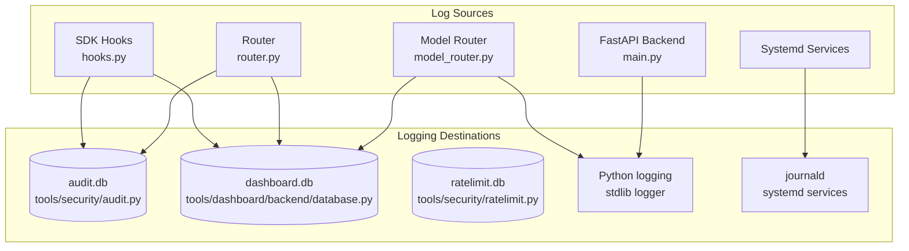
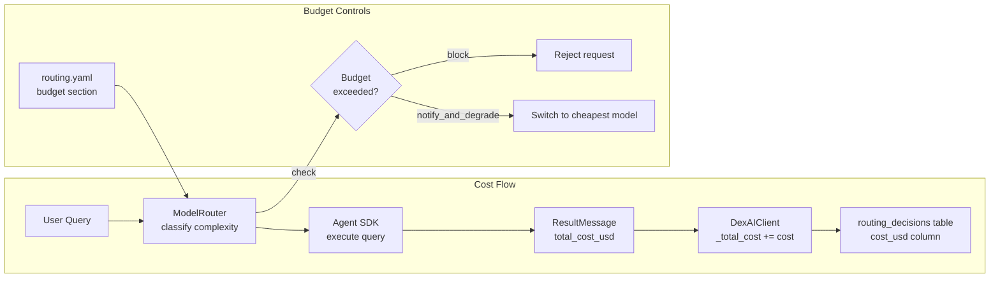
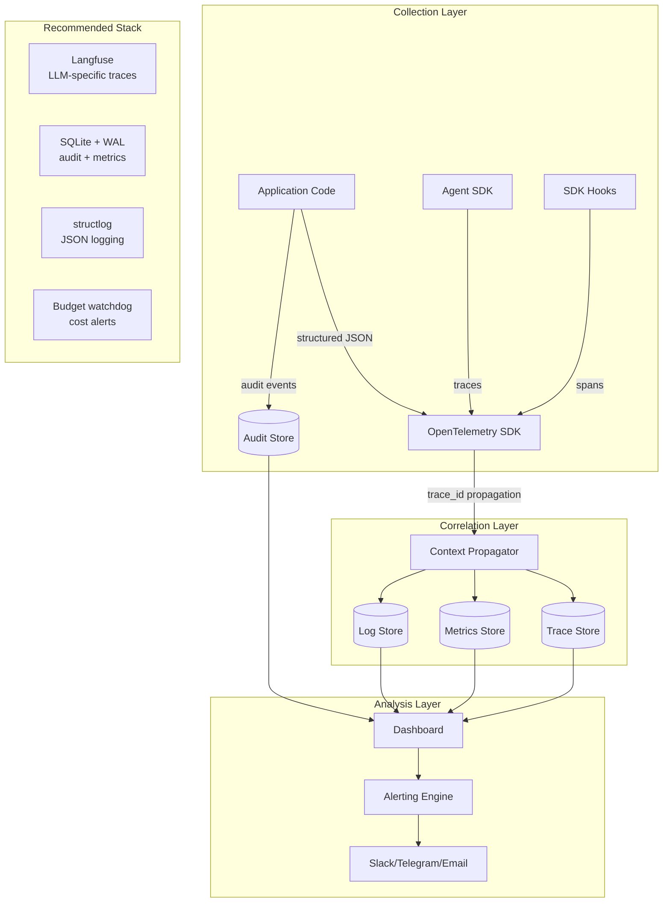

# DexAI Observability, Auditability & Operations Review

**Date:** 2026-02-11
**Reviewer:** Agent 6 — Observability & Operations Specialist

---

## Research Baseline

### Industry State-of-the-Art (2025-2026)

**OpenTelemetry GenAI Semantic Conventions** — The OTEL community has finalized draft AI agent semantic conventions based on Google's AI agent white paper. Auto-instrumentation is now considered the ideal approach for agent observability, with semantic extensions enabling standard telemetry collection alongside traditional applications. ([OpenTelemetry Blog](https://opentelemetry.io/blog/2025/ai-agent-observability/))

**Audit Logging for AI Agents** — Best practices now mandate structured JSON logging with consistent keys (user_id, session_id, agent_id, step_type, tool_invoked, intermediate_steps). Tamper-proof append-only storage is required for regulated deployments. HIPAA requires 6-7 years retention; SOX 5-7 years; GDPR caps at 90 days unless justified. ([Medium - Pranav Prakash](https://medium.com/@pranavprakash4777/audit-logging-for-ai-what-should-you-track-and-where-3de96bbf171b), [Galileo AI](https://galileo.ai/blog/ai-agent-compliance-governance-audit-trails-risk-management))

**Letta Agent Observability** — Letta's Agent Development Environment provides real-time memory inspection, context window visibility, and decision-trace replay. Engineers can inspect reasoning steps, tool calls, and memory mutations in a unified interface. ([Letta Docs](https://docs.letta.com/guides/observability/responses/))

**Introspective Logging** — Instead of logging only outputs, developers must log the decision path — what options were evaluated, what was rejected, and why. This is critical for fault localization in multi-agent systems. ([GoCodeo](https://www.gocodeo.com/post/debugging-agentic-ai-logging-monitoring-and-explainability))

**Cost Tracking** — Leading tools (Helicone, LangChain, Braintrust, WrangleAI) now provide real-time dashboards for token usage, latency, request volume, and cost per feature/user/cohort with budget caps and instant alerts. ([Braintrust](https://www.braintrust.dev/articles/best-ai-observability-tools-2026), [Statsig](https://www.statsig.com/perspectives/tokenusagetrackingcontrollingaicosts))

---

## Current Observability Maturity

### Assessment: Level 2.5 / 5 (Developing)

| Maturity Level | Description | DexAI Status |
|----------------|-------------|--------------|
| **Level 1** — Ad-hoc | Print statements, no structured logging | Exceeded |
| **Level 2** — Basic | Structured events, basic dashboards | **Current** |
| **Level 3** — Systematic | Correlation IDs, distributed tracing, alerting | Partially |
| **Level 4** — Proactive | Anomaly detection, SLO tracking, auto-remediation | Not yet |
| **Level 5** — Predictive | AI-driven diagnostics, capacity planning, cost forecasting | Not yet |

**Strengths:** DexAI has a solid foundation — audit logging exists, dashboard events are captured, cost tracking is wired up, and WebSocket real-time updates work. The hook system (`tools/agent/hooks.py`) is well-architected with timing metrics.

**Key Gap:** No correlation/trace IDs flow end-to-end through the system. A single user message generates audit events, dashboard events, routing decisions, and hook metrics — but there's no way to correlate them across these separate SQLite databases.

---

## Logging Assessment

### Current Architecture

### Structured vs. Unstructured

| Component | Format | Structured? | Destination |
|-----------|--------|-------------|-------------|
| Audit logger (`audit.py:109-178`) | SQL rows with JSON details | **Yes** | `data/audit.db` |
| Dashboard events (`database.py:218-258`) | SQL rows with JSON details | **Yes** | `data/dashboard.db` |
| Routing decisions (`database.py:1077-1124`) | SQL rows | **Yes** | `data/dashboard.db` |
| Hook metrics (`hooks.py:51-200`) | In-memory dict | **Partial** — lost on restart | Memory only |
| Python logging (`main.py:41-43`) | `%(asctime)s - %(name)s - %(levelname)s - %(message)s` | **No** — plain text | stdout/stderr |
| Systemd services (`dexai.service:50-52`) | journald | **No** — plain text | journald |

### Issues Found

1. **Log format inconsistency** — Python `logging.basicConfig` at `main.py:41-43` uses plain text format. No JSON structured logging is configured for stdout. When running in Docker, this means container logs are unstructured, making aggregation tools (ELK, Datadog, Loki) harder to use.

2. **No log levels in database events** — Dashboard events use `severity` (info/warning/error) but this doesn't map to standard log levels (DEBUG/INFO/WARNING/ERROR/CRITICAL). The audit logger uses `status` (success/failure/blocked) which is separate from severity.

3. **Silent exception swallowing** — Multiple locations catch exceptions and pass silently:
   - `router.py:61` — `pass  # Never let logging break message flow`
   - `router.py:79` — `pass` in metric recording
   - `hooks.py:539` — `logger.debug(f"Failed to log security event: {e}")`
   - `hooks.py:810-811` — `pass  # Dashboard not available`

   While the philosophy of "never let observability break the app" is correct, completely swallowing errors means you can't tell when your observability is broken.

4. **Hook metrics are ephemeral** — `HookMetrics` singleton at `hooks.py:51-200` stores timing data in memory only. All performance data is lost on restart. The `_metrics` singleton has no persistence layer.

5. **No request ID / correlation ID** — Messages flow through sanitizer → rate limiter → permissions → handler → SDK → response, but there's no trace ID linking these steps. The `message.id` exists but isn't consistently propagated to all log destinations.

---

## Audit Trail Assessment

### Completeness

| Event Category | Logged? | Location | Gap |
|----------------|---------|----------|-----|
| Authentication (login/logout) | **Yes** | `audit.py` | Session creation logged, but no session expiry logging |
| Permission checks | **Yes** | `audit.py` | Both grants and denials |
| Dangerous command blocks | **Yes** | `hooks.py:384-403` | Good — logged to audit with pattern detail |
| Tool invocations (PreToolUse) | **Yes** | `hooks.py:706-745` | Status is "attempted" — no PostToolUse result logging |
| Tool results (PostToolUse) | **Partial** | `hooks.py:776-817` | Only records to dashboard, not audit trail |
| Rate limit events | **Yes** | `ratelimit.py` + `audit.py` | Covered |
| Inbound messages | **Yes** | `router.py:466-484` | Content not stored in audit (good for privacy) |
| Outbound messages | **Yes** | `router.py:647-660` | Audit logged |
| Model routing decisions | **Yes** | `model_router.py:873-887` | Stored in `routing_decisions` table |
| Memory reads/writes | **No** | — | **GAP** — No audit trail for memory access |
| Context captures/restores | **No** | — | **GAP** — Critical for ADHD resumption debugging |
| Agent reasoning steps | **No** | — | **GAP** — No "thinking" trace, only final output |
| Cost per conversation | **Partial** | `sdk_client.py:788` | Session total tracked, not persisted to DB per-conversation |
| Configuration changes | **No** | — | **GAP** — YAML changes not audited |
| User data exports | **No** | — | **GAP** — GDPR requires knowing who exported what |

### Tamper-Evidence

**Current:** SQLite with no integrity checks. The audit log at `audit.py:66-82` is declared "append-only" in comments, but:
- Nothing prevents `DELETE` or `UPDATE` at the database level
- No hash chain or digital signatures on entries
- The `cleanup_old_events` function at `audit.py:420-460` explicitly allows deletion
- No WAL (Write-Ahead Log) mode for crash safety

**Recommendation:** For true tamper-evidence:
1. Enable WAL mode: `conn.execute("PRAGMA journal_mode=WAL")`
2. Add a `hash_chain` column where each entry's hash includes the previous entry's hash
3. Move cleanup to an archival process (export to cold storage before delete)

### Queryability

**Good:** The audit system supports filtering by type, user, session, channel, status, and time range (`audit.py:202-298`). Indexes exist for common queries (`audit.py:85-89`). The dashboard audit route (`audit.py` route) transforms data for frontend consumption.

**Gap:** No full-text search on audit details. The `details` column stores JSON, but queries can't search inside it without LIKE patterns.

### Dual Audit Systems

**Issue:** There are TWO separate audit log tables:
1. `data/audit.db` → `audit_log` table (via `tools/security/audit.py:67-82`)
2. `data/dashboard.db` → `audit_log` table (via `tools/dashboard/backend/database.py:95-105`)

These have **different schemas** (security audit has `user_id, session_id, channel, action, resource, status`; dashboard audit has `actor, target, severity`). This split creates confusion about where to look for events and risks data inconsistency.

---

## Metrics & Dashboards

### What's Tracked

| Metric | Tracked? | Location | Granularity |
|--------|----------|----------|-------------|
| Messages inbound/outbound | **Yes** | `router.py:539-544, 677-681` | Per-message, per-channel |
| Response time | **Yes** | `router.py:498-503, 587-592` | Per-message (ms) |
| API cost (USD) | **Yes** | `database.py:786-796` | Aggregated per-day |
| Tasks today | **Yes** | `database.py:757-765` | Per-day |
| Error rate | **Yes** | `database.py:822-823` | Per-day |
| Active channels | **Yes** | `database.py:799-806` | Per-day |
| Model routing distribution | **Yes** | `database.py:1126-1218` | Per-query |
| Routing cost savings | **Yes** | `database.py:1187-1194` | Estimated, per-period |
| System metrics (CPU/RAM/disk) | **Yes** | `metrics.py:236-279` | On-demand (psutil) |
| Flow state | **Yes** | `metrics.py:337-403` | On-demand |
| Hook performance | **Yes** | `hooks.py:167-194` | In-memory only |
| Token usage (input/output) | **No** | — | **GAP** |
| Latency per model | **No** | — | **GAP** |
| Error rate per channel | **No** | — | **GAP** — Need per-channel error breakdown |
| Queue depth/backpressure | **No** | — | **GAP** |
| Memory provider health | **Partial** | `memory.py:329-442` | On-demand, no history |

### What's Missing

1. **Token-level tracking** — The system tracks cost in USD but doesn't record input/output token counts. The `TimeSeriesResponse` model at `metrics.py:143-144` has `tokens_in` and `tokens_out` mappings, but these are never populated.

2. **Per-conversation cost** — `sdk_client.py:788` accumulates `_total_cost` per session but this is in-memory only. When the session ends, the per-conversation cost isn't written to any persistent store.

3. **Historical system metrics** — `metrics.py:236-279` returns current CPU/memory/disk usage but doesn't record historical values. There's no time-series for system resource usage.

4. **Alerting** — No alerting mechanism exists. The `routing.yaml:55-59` defines budget limits and `limit_action: "notify_and_degrade"`, but there's no notification pipeline (no email, Slack, or webhook alerts when thresholds are breached).

### Dashboard Frontend Assessment

The frontend has four observability pages:

| Page | File | Functionality | Status |
|------|------|---------------|--------|
| **Metrics** | `app/metrics/page.tsx` | Charts (cost, messages, tasks, response time), stat cards, routing stats | Good — uses Recharts with line/bar/pie charts |
| **Audit** | `app/audit/page.tsx` | Filterable event list, severity badges, export | Good — with demo fallback data |
| **Activity** | `app/activity/page.tsx` | Real-time activity feed with infinite scroll | Good — cursor-based pagination |
| **Debug** | `app/debug/page.tsx` | System info, DB query, log viewer, connection tests | Good — admin tools |

**Strength:** Real-time WebSocket updates via `websocket.py:28-138` push state changes, activity events, task updates, and metrics to connected clients. The batching mechanism at `websocket.py:111-138` handles high-frequency events.

**Weakness:** No dashboard page for:
- End-to-end request tracing (request → security → routing → SDK → response)
- Memory access history
- Token usage breakdown
- Budget burn rate / projection

---

## Cost Tracking

### Current Architecture

### Strengths

1. **Per-query cost capture** — `sdk_client.py:779-780` extracts `total_cost_usd` from SDK ResultMessage and accumulates per-session.
2. **Routing decision logging** — `model_router.py:873-887` records every routing decision with complexity, model, and cost to the dashboard database.
3. **Budget controls** — `routing.yaml:43-59` defines per-session ($5), per-day ($50), and per-user-per-day ($10) limits with configurable actions (block/notify/degrade).
4. **Cost savings estimation** — `database.py:1187-1194` calculates estimated savings from routing trivial/low queries to Haiku vs. Sonnet.

### Gaps

1. **No persistent per-conversation cost** — `sdk_client.py:1215-1217` exposes `total_cost` as a property, but this value lives in memory. When the session object is garbage collected, the cost data is gone. Only routing decisions get persisted, and `cost_usd` in routing_decisions is often NULL (set by caller, which may not pass it).

2. **No budget alerting** — The budget section in `routing.yaml:55-59` defines limits and actions, but there's no notification when limits are approached (e.g., "you've used 80% of today's budget"). The `limit_action` field is defined but the enforcement code in model_router only logs.

3. **No cost attribution** — Cannot answer "what skill/tool/conversation cost the most?" Token usage isn't tracked per-tool-invocation, only per-query-total.

4. **Rate limiter cost tracking is separate** — `ratelimit.py:47-48` tracks cost per-hour ($1) and per-day ($10) independently from the routing budget controls. These two systems don't communicate, risking inconsistent enforcement.

---

## Operational Ergonomics

### Start/Stop/Restart

| Operation | Method | Assessment |
|-----------|--------|------------|
| **Docker start** | `docker compose up -d` or `make deploy` | Good — single command |
| **Docker stop** | `docker compose down` or `make down` | Good |
| **Development** | `make dev` (backend + frontend) | Good — trap-based parallel processes |
| **Systemd** | `systemctl start/stop/restart dexai` | Good — proper unit files |
| **Channel adapters** | `make channels` | Good — separate from backend |

**Strength:** Three deployment modes (Docker, systemd standalone, development) with clear Makefile targets.

### Health Checks

| Component | Health Check | Interval | Assessment |
|-----------|-------------|----------|------------|
| Backend (Docker) | `httpx.get('http://localhost:8080/api/health')` | 30s | Good — uses actual HTTP check |
| Frontend (Docker) | `wget --spider http://127.0.0.1:3000` | 30s | OK — basic connectivity |
| Caddy (Docker) | `wget --spider http://localhost:8888/health` | 30s | Good |
| Backend (API) | `GET /api/health` | On-demand | **Excellent** — checks DB, sessions, memory, channels |

**`/api/health` endpoint** (`main.py:268-356`) is comprehensive:
- Checks dashboard database connectivity
- Checks session database
- Checks memory database
- Checks channel adapter health with timeouts (3s per adapter)
- Returns per-service status with overall health

**Gap:** No health check for:
- Anthropic API reachability
- OpenRouter API reachability
- Disk space remaining
- Certificate expiry (for Caddy HTTPS)

### Error Surfacing

**Current approach:** Errors are logged to dashboard events and displayed in the activity feed. The debug page (`debug.py:255-320`) shows error counts for the last hour. The `general_exception_handler` at `main.py:373-380` catches unhandled exceptions.

**Gap:** No error aggregation or deduplication. If the Anthropic API returns 429 (rate limited) 100 times in a row, you get 100 identical dashboard events. No circuit breaker pattern.

### Upgrades

**Docker:** Rebuild and restart — `docker compose build && docker compose up -d`. No blue-green or rolling deployment. Data persists in Docker volumes.

**Bare metal:** Manual process. No migration framework — `db-migrate` target in Makefile says "Manual migration not yet implemented" (`Makefile:172-173`).

**Gap:** No version migration tracking. Database schema changes are applied via `CREATE TABLE IF NOT EXISTS` and `ALTER TABLE ADD COLUMN` wrapped in try/except (`database.py:107-118`), which is fragile. No rollback capability.

### Backup/Restore

**Current:** `make db-backup` copies `data/*.db` to `backups/` (`Makefile:176-179`).

**Gaps:**
- No automated backup schedule
- No backup verification (does the backup actually work?)
- No restore procedure documented
- No backup for non-DB data (YAML configs, memory files, credentials)
- No offsite backup support
- SQLite backup while the app is running can produce corrupted files (no `.backup` API or WAL checkpoint used)

---

## User Transparency

### Tool Usage Visibility

**Current:** The dashboard activity feed shows tool invocations via `hooks.py:706-745` (PreToolUse audit hook) and results via `hooks.py:776-817` (PostToolUse dashboard hook). The WebSocket broadcasts activity events in real-time.

**Gap:** The user can see *what* tools were used but not *why*. Agent reasoning steps (the "thinking" that led to a tool choice) are not captured. Letta's approach of exposing the full decision trace is significantly ahead here.

### Memory Access

**Current:** The memory API (`memory.py:110-182`) exposes search, commitments, and context snapshots. Users can see what's in memory and trigger search.

**Gap:** No visibility into *when* memories were accessed during a conversation. If the agent reads 5 memories to answer a question, the user can't see which memories influenced the response. This is a transparency concern for ADHD users who need to trust the system.

### "Show Your Work" Mode

**Not implemented.** There's no toggle to make the agent surface its reasoning, tool usage, and memory access as part of the conversation. This would be valuable for:
- Debugging incorrect responses
- Building user trust ("I checked your calendar and found...")
- ADHD users who benefit from seeing the process

---

## Proposed Observability Architecture

### Key Design Decisions

1. **Use `structlog` instead of stdlib `logging`** — Structured JSON output, automatic context binding, compatible with any log aggregator.
2. **Add trace_id to every request** — Generate at the router, propagate through hooks/SDK/handlers. Store in all database tables.
3. **Enable Langfuse** — Already wired up in `routing.yaml:224-229` but disabled. This provides per-request token usage, latency, and cost tracking with zero code changes.
4. **Consolidate audit tables** — Merge the two audit systems into one with a superset schema.
5. **Persist hook metrics** — Write HookMetrics to dashboard_metrics every N minutes.

---

## Operational Runbook Gaps

### What's Missing for 2am Troubleshooting

| Scenario | Runbook Exists? | What's Needed |
|----------|-----------------|---------------|
| Backend crashes and won't restart | **No** | Check logs: `journalctl -u dexai -n 100`. Common causes: DB lock, port conflict, missing .env |
| Telegram adapter stops receiving | **No** | Check adapter health via `/api/health`. Restart channels: `systemctl restart dexai-channels`. Check token validity |
| Anthropic API returns 429 | **No** | Check rate limits dashboard. Budget controls should auto-degrade. Verify OPENROUTER_API_KEY fallback |
| SQLite database locked | **No** | Stop all writers. Check for zombie processes. Enable WAL mode. Run `PRAGMA integrity_check` |
| Memory database corruption | **No** | Restore from `backups/`. Re-index: `python tools/memory/memory_db.py --action reindex` |
| Cost spike (unexpected) | **No** | Check routing_decisions table for anomalies. Verify budget controls in routing.yaml. Check for infinite tool loops |
| User reports wrong response | **No** | No conversation replay capability. Need: session_id → query log → tool invocations → response |
| SSL certificate expiry (Caddy) | **No** | Caddy auto-renews, but no monitoring for failures. Need: cert expiry metric in health check |
| Disk full | **No** | SQLite will fail on write. Need: disk usage alert at 80%. DB sizes visible in debug page but not monitored |
| Docker OOM kill | **No** | Check `docker inspect` for OOMKilled. Backend limited to 4GB, frontend to 8GB. Need: memory usage tracking |

---

## Recommendations

*Prioritized by "what helps most when something goes wrong at 2am"*

### P0 — Critical (Do This Week)

1. **Add trace_id to the request lifecycle**
   - Generate UUID in `router.py:route_inbound` at line 446
   - Add to `UnifiedMessage` model
   - Propagate to all audit.log_event, dashboard log_event, and hook calls
   - **Why:** Without this, correlating a failed request across audit.db, dashboard.db, and Python logs is essentially impossible
   - **Effort:** ~2 hours

2. **Enable Langfuse tracing**
   - Set `observability.langfuse.enabled: true` in `args/routing.yaml:226`
   - Configure LANGFUSE_PUBLIC_KEY and LANGFUSE_SECRET_KEY in .env
   - **Why:** Immediate per-request token tracking, cost attribution, and latency visibility with zero code changes
   - **Effort:** ~30 minutes

3. **Switch to structured JSON logging**
   - Replace `logging.basicConfig` at `main.py:41-43` with `structlog` configuration
   - Bind trace_id, user_id, channel to log context
   - **Why:** Enables log aggregation and search across all components
   - **Effort:** ~1 hour

### P1 — Important (Do This Sprint)

4. **Consolidate audit trail**
   - Merge `data/audit.db` and `data/dashboard.db:audit_log` into a single audit system
   - Use the richer schema from `security/audit.py` as the canonical source
   - Add `trace_id` column
   - **Why:** Two audit systems = confusion about where events live
   - **Effort:** ~4 hours

5. **Persist hook metrics**
   - Add periodic flush (every 5 minutes) from `HookMetrics` in-memory store to `dashboard_metrics` table
   - Add `/api/metrics/hooks` endpoint to expose hook performance
   - **Why:** Performance degradation investigation requires historical data
   - **Effort:** ~2 hours

6. **Add budget alerting**
   - Create a `BudgetWatchdog` that checks spend vs. limits every N minutes
   - Send notifications via existing channel adapters when approaching limits (80%, 95%, 100%)
   - Wire to the `limit_action` field in `routing.yaml:59`
   - **Why:** Cost overruns are a real risk with AI agents, especially during development
   - **Effort:** ~4 hours

7. **Add memory access auditing**
   - Log memory reads, writes, searches, and context captures to the audit trail
   - Include user_id, query, results_count, and latency
   - **Why:** Memory is a core DexAI feature; understanding access patterns is critical for debugging and trust
   - **Effort:** ~3 hours

### P2 — Valuable (Next Sprint)

8. **Create operational runbook**
   - Document the top 10 failure scenarios with step-by-step resolution
   - Include log locations, common root causes, and recovery commands
   - Store in `docs/RUNBOOK.md`
   - **Why:** The person debugging at 2am may not be the person who built the system
   - **Effort:** ~3 hours

9. **Add safe SQLite backup with WAL**
   - Enable WAL mode on all databases: `PRAGMA journal_mode=WAL`
   - Use SQLite `.backup()` API for consistent backups
   - Add automated daily backup to `make db-backup`
   - Add backup verification step
   - **Why:** Current `cp data/*.db backups/` can produce corrupt backups if the DB is being written to
   - **Effort:** ~2 hours

10. **Add database migration framework**
    - Track schema versions in a `schema_version` table
    - Apply migrations in order on startup
    - Support rollback
    - **Why:** The current try/except ALTER TABLE approach is fragile and untrackable
    - **Effort:** ~4 hours

11. **Implement "Show Your Work" mode**
    - Add a `verbose: true` flag to queries that surfaces tool usage, memory access, and routing decisions as part of the response
    - Display in the dashboard chat interface
    - **Why:** Builds trust and aids debugging, especially for ADHD users
    - **Effort:** ~6 hours

### P3 — Nice to Have (Future)

12. **Add per-conversation cost persistence** — Write session `_total_cost` to a conversations table on session end, keyed by session_id
13. **Add circuit breaker for external APIs** — Prevent cascading failures when Anthropic/OpenRouter is down
14. **Add Prometheus-compatible metrics endpoint** — `/metrics` in OpenMetrics format for external monitoring (Grafana, etc.)
15. **Add conversation replay** — Given a session_id, reconstruct the full conversation with tool calls, routing decisions, and memory access
16. **Enable hash chain on audit entries** — Each row includes SHA-256 of (previous_hash + current_row), enabling tamper detection

---

## Summary

DexAI's observability foundation is solid — the hook system, dual-layer audit logging, cost-aware routing, real-time WebSocket updates, and comprehensive health checks demonstrate deliberate engineering. The main gaps are **correlation** (no trace_id), **persistence** (hook metrics, per-conversation costs), and **alerting** (no notification pipeline for budget/error thresholds).

The highest-impact improvement is adding a trace_id that flows from the router through every audit event, dashboard event, and log message. This single change transforms debugging from "grep across 5 databases" to "filter by trace_id" — a massive quality-of-life improvement for operations.

The second highest-impact change is enabling Langfuse, which is already wired up but disabled. This gives immediate token-level cost tracking and latency visibility with essentially zero code changes.
